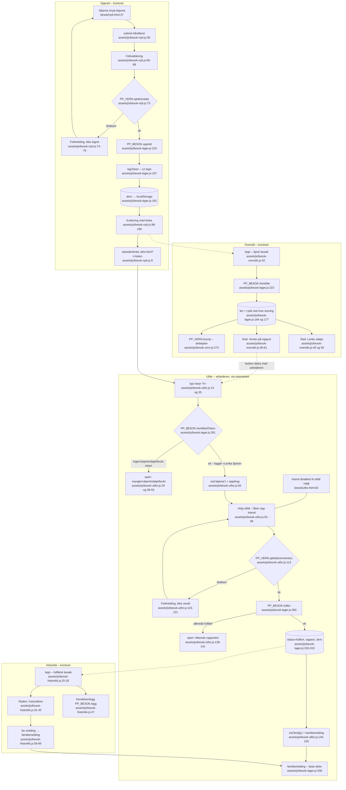

# Besøkets livsløp – flytdiagram (Pathfinder fase 1, 2026-08-24)

Sporer ett besøk fra skjemaet i `besok/nytt.html` til raden i historikken,
gjennom de faktiske funksjonene i koden. Alle fil:linje-referanser er lest,
ikke antatt.

## Kilder (faktisk lest)

| Fil | Linjeområde |
|---|---|
| `/home/user/BETA-ART/besok/nytt.html` | 1–118 (hele) |
| `/home/user/BETA-ART/besok/utfor.html` | 1–110 (hele) |
| `/home/user/BETA-ART/assets/js/besok-nytt.js` | 1–124 (hele) |
| `/home/user/BETA-ART/assets/js/besok-oversikt.js` | 1–95 (hele) |
| `/home/user/BETA-ART/assets/js/besok-utfor.js` | 1–170 (hele) |
| `/home/user/BETA-ART/assets/js/besok-historikk.js` | 1–86 (hele) |
| `/home/user/BETA-ART/assets/js/besok-lager.js` | 1–398 (hele) |
| `/home/user/BETA-ART/assets/js/besok-vern.js` | 1–340 (hele) |
| `/home/user/BETA-ART/besok/oversikt.html`, `historikk.html` | kun script-linjene 70–72 / 78–80 (grep) |
| `/home/user/BETA-ART/assets/js/besok-klage.js` | kun linje 211 og 442 (grep, for å bekrefte `medarbeidervarsel`) |

## Den lykkelige stien, i tekst

1. **Skjema** – `besok/nytt.html:37` (`#nytt-skjema`), fem felter + valgfri
   pårørende-epost og notat. Skript lastes på `nytt.html:114–116`
   (lager → vern → nytt, i den rekkefølgen).
2. **Submit-håndterer** – `besok-nytt.js:50–101`. Validering av påkrevde felt
   (`besok-nytt.js:60–65`), e-postregex (`:67`), og PP_VERN-sperre på notatet
   **før** lagring: `window.PP_VERN.sjekk(notat)` på `besok-nytt.js:73`.
3. **Opprettelse** – `L.opprett({...})` på `besok-nytt.js:85` →
   `PP_BESOK.opprett()` i `besok-lager.js:210–221`: setter `id` («B-1001…»),
   `token` via `lagToken()` (`besok-lager.js:197–202`, 12 tegn),
   `opprettet`, `utloper = nå + 12 t` (`:215`, `LENKE_TIMER = 12` på `:148`),
   `status: 'planlagt'`, loggfører «Besøk opprettet» (`loggfor`,
   `besok-lager.js:204–208`) og skriver til localStorage via `skriv()`
   (`besok-lager.js:191–194`, nøkkel `pp_besok_v1`, `:16`).
4. **Kvittering med arbeiderlenke** – `besok-nytt.js:96–100`: lenken bygges av
   `arbeiderlenke(besok.token)` (`besok-nytt.js:9–12`) →
   `utfor.html?t=<token>`.
5. **Oversikt** – `besok-oversikt.js:42–62` (`tegn()`): `L.hentAlle()`
   (`besok-lager.js:223`) → `les()` (`:164–171`) → **`rydd()` kjører ved hver
   lesning** (`:177–189`). Filtrerer `status !== 'fullfort'`
   (`besok-oversikt.js:43`); raden viser «Venter på rapport» eller «Lenke
   utløpt» (`:49–51`, utløpssjekk `:40`). Klikk på rad viser detalj med samme
   lenke (`:64–85`).
6. **Arbeideren åpner tokenlenken** – `besok/utfor.html` laster
   `besok-utfor.js` på `utfor.html:108`. `kjor()` (`besok-utfor.js:13`) leser
   `?t=` via `param('t')` (`:16–21`, `:35`) og kaller `L.hentMedToken(token)`
   (`:41`) → `besok-lager.js:291–301`: finner besøket på token, loggfører
   «Lenke åpnet av arbeider» (`:298`) og skriver. Skjemaet vises
   (`vis('skjema')`, `besok-utfor.js:84`) med kunde/tid/oppgaver
   (`:62–64`) og evt. notat (`:74–77`).
7. **Utfall velges** – knappene `[data-utfall]` (`utfor.html:44–63`,
   håndterer `besok-utfor.js:91–103`). `#send` starter `disabled`
   (`utfor.html:82`) og låses opp først når et utfall er valgt
   (`besok-utfor.js:99`).
8. **Innsending** – `besok-utfor.js:105–156`: kommentaren sjekkes med
   `PP_VERN.sjekk(kommentar)` **før** innsending (`:113`); rapportobjektet
   bygges (`:131–136`: utfall, sjekkliste, kommentar, sekunder) og
   `L.fullfor(token, rapport)` kalles (`:138`) →
   `besok-lager.js:303–317`: setter `status: 'fullfort'`, `rapport`,
   `fullfortTid`, loggfører «Rapport levert (…)» (`:313`) og – hvis
   `parorendeEpost` finnes – «Melding sendt til pårørende» (`:314`), så
   `skriv()`.
9. **Kvittering til arbeider** – `vis('ferdig')` (`besok-utfor.js:155`);
   familiemeldingen bygges av faste deler i `familiemelding()`
   (`besok-lager.js:330–359`) og vises (`besok-utfor.js:150`).
10. **Historikk** – `besok-historikk.js:25–56` (`tegn()`): `L.hentAlle()`
    filtrert på `status === 'fullfort'` (`:26`) blir **raden i historikken**
    (`:31–45`) med utfall fra `L.UTFALL` (`besok-lager.js:135–141`).
    Hendelsesloggen tegnes fra `L.logg()` (`besok-historikk.js:47–55`,
    `besok-lager.js:319`). «Se melding» gjengir `familiemelding(b)`
    (`besok-historikk.js:58–71`).

## Flytdiagram

## Sideeffekter

| Sideeffekt | Hvor | Detalj |
|---|---|---|
| localStorage-nøkkel `pp_besok_v1` | `besok-lager.js:16` (`NOKKEL`), skrives i `skriv()` `:191–194` og i `rydd()` `:186` | Hele datastrukturen: `leverandor`, `logg`, `foresporsler`, `ansatte`, `besok` |
| `rydd()` ved **hver** lesning | `besok-lager.js:164–189` – `les()` kaller alltid `rydd()`, som kaller `PP_VERN.krymp` per besøk og skriver tilbake bare hvis noe krympet | Sletting er lesestyrt, ikke en nattjobb |
| Sletteplanen (`PP_VERN.SLETTEPLAN`, `besok-vern.js:85–106`) | steg 1: **12 t** → `token` bort; steg 2: 7 d → `notat`, `rapport.kommentar`; steg 3: 30 d → `kunde`, `parorendeEpost`, `ansattNavn`; steg 4: 365 d → resten, `dato` grovnes til måned | Regnes fra `fullfortTid`, ellers `opprettet` (`besok-vern.js:275`) |
| Tokenutløp 12 t | `LENKE_TIMER = 12` (`besok-lager.js:148`), `utloper` settes i `opprett()` `:215`, håndheves i `hentMedToken()` `:296` | To mekanismer: avvisning ved bruk (utløpt) og fysisk fjerning av token (sletteplan steg 1) |
| Hendelseslogg | `loggfor()` `besok-lager.js:204–208`, maks 200 rader | Skrives ved opprettelse (`:218`), lenkeåpning (`:298`), rapport (`:313`) og pårørendemelding (`:314`) |
| Engangsbruk | `fullfor()` `besok-lager.js:308` og `hentMedToken()` `:295` returnerer `'brukt'` når `status === 'fullfort'` | Dobbeltinnsending overskriver aldri første rapport |
| Blokkert PP_VERN-innhold lagres ikke | `besok-vern.js:225–232` – bare `logglinje` med funn-id-er, aldri teksten | Sperren etterlater ikke bevis-kopi |

## Feilgrener (kort)

- **PP_VERN-blokkering, opprettelse:** `besok-nytt.js:73–79` – `vern.beskjed`
  vises i `[data-error-for="notat"]`, skjemaet sendes ikke.
- **PP_VERN-blokkering, rapport:** `besok-utfor.js:113–123` – beskjed vises,
  fokus tilbake til `#kommentar`, ingen innsending.
- **Manglende/ugyldig/utløpt/brukt token:** `besok-utfor.js:36–55` → `sperr()`
  (`:29–33`) med fire ulike tekster; statusene kommer fra `hentMedToken()`
  (`besok-lager.js:294–296`). Oversikten viser «Lenke utløpt» på egne rader
  (`besok-oversikt.js:40, 49–51`) og ber om nyopprettelse (`:79`).
- **Disabled `#send`:** starter `disabled` (`utfor.html:82`), låses opp ved
  utfallsvalg (`besok-utfor.js:99`), guard `if (!valgtUtfall) return`
  (`:106`), og settes `disabled` igjen før `fullfor` (`:125`) mot dobbeltklikk.
- **Kappløp om innsending:** `fullfor()` returnerer `'brukt'`
  (`besok-lager.js:308`) → «Rapporten var allerede sendt inn»
  (`besok-utfor.js:139–141`).

## Eksterne avhengigheter (andre PP_*-moduler)

| Modul | Kalles fra | Funksjon |
|---|---|---|
| `PP_VERN` (`assets/js/besok-vern.js`) | `besok-nytt.js:73`, `besok-utfor.js:113` (sjekk); `besok-lager.js:181` (krymp) | Fritekstsperre før lagring, krymping ved lesning |
| `PP_KLAGE` (`assets/js/besok-klage.js:211`) | `besok-utfor.js:70–72` | `medarbeidervarsel(sprak)` – tillitsvarselet over rapportskjemaet; lastes i `utfor.html:107` |
| `PP_RUTER` / `PP_ENFIL` (settes av `assets/js/app.js` i ett-fils-versjonen) | `besok-nytt.js:121–123`, `besok-oversikt.js:92–94`, `besok-utfor.js:167–169`, `besok-historikk.js:83–85`; lenkebygging `besok-nytt.js:10`, `besok-oversikt.js:10`; token via `window.__ppToken` `besok-utfor.js:18` | Samme skjermer kjører både som egne sider og med hash-ruting |
| `PP_BESOK` (`assets/js/besok-lager.js`) | Alle fire skjermmodulene | Selve datalaget – bærebjelken flyten går gjennom |

`PP_EKSPERT` nevnes bare i en kommentar i `besok-vern.js:156` og kalles ikke
fra denne flyten.

## Tillitsnotat og hull

**Tillit: høy.** Alle seks kjernefilene er lest i sin helhet, og hver node i
diagrammet peker på lest kode. Kallkjeden skjema → `opprett` → `hentMedToken`
→ `fullfor` → historikkrad er verifisert i begge ender (kallsted og
definisjon).

Hull og forbehold:

- **Ikke kjørt.** Flyten er sporet statisk; ingen tester eller nettleser er
  kjørt i denne fasen (Pathfinder fase 1 er kartlegging).
- **Ett-fils-versjonen** (`PP_ENFIL`/`app.js`, `besok/index.html:185`) er ikke
  lest; diagrammet dekker fler-sidersvarianten. Rutetabellen `PP_RUTER` er
  bekreftet i alle fire skjermmodulene, men `app.js` sin bruk av den er antatt
  ut fra kommentarene (`besok-nytt.js:119–120`).
- **Sekundærstien forespørsel → tildeling** (`nyForesporsel`/`tildel`,
  `besok-lager.js:232–271`) munner ut i samme `opprett()` og er utelatt fra
  diagrammet med vilje – den er ikke den primære lykkelige stien.
- **`besok-klage.js`** er kun verifisert på funksjonsnivå (linje 211/442),
  ikke lest i sin helhet.
- **Utfallsknappen `kontakt_familie`** (`utfor.html:56–59`) har avvikende
  markup (`a-ikon`/`a-tekst` i stedet for `ik`/`small`) – notert som mulig
  inkonsistens, ikke undersøkt videre (utenfor oppdraget).
