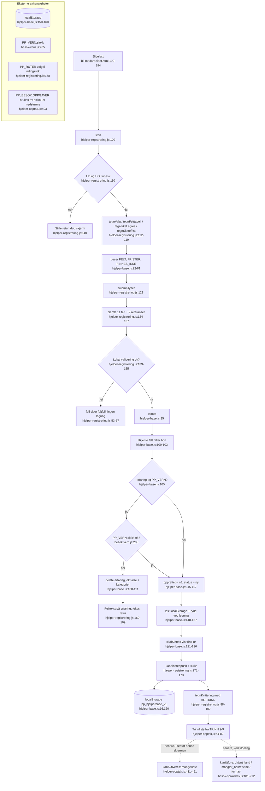

# Flyt A – Medarbeiderregistrering

Pathfinder fase 1 · 2026-08-24 · Kartlagt fra kode, ikke fra kjøring.

## Kilder

| Fil | Linjer | Rolle |
|---|---|---|
| `besok/bli-medarbeider.html` | 49–186 (skjema/kvittering/felttabell), 190–194 (skriptlasting) | Skjermen. Laster modulene i rekkefølgen vern → språkkrav → opptak → base → registrering |
| `assets/js/hjelper-registrering.js` | 1–184 | Skjermlogikken: bygger skjema, validerer, kaller basen |
| `assets/js/hjelper-base.js` (`PP_HJELPERBASE`) | 22–40 (`FELT`), 71–81 (`FRISTER`), 95–118 (`taImot`), 121–146 (`fristFor`/`skalSlettes`/`rydd`), 148–162 (`les`/`skriv`) | Kandidatbasen og mottakssperren |
| `assets/js/hjelper-opptak.js` (`PP_HJELPER`) | 54–82 (`TRINN`), 431–451 (`kanAktiveres`), 456–474 (`vurderIntervju`) | Opptaksreglene. På denne skjermen brukes bare `TRINN` (til kvitteringen) |
| `assets/js/besok-sprakkrav.js` (`PP_SPRAKKRAV`) | 55–60 (`OPPGAVEKRAV`), 142–158 (`kravFor`/`kravForBesok`), 181–212 (`kanUtfore`) | Språkkravet. Håndheves ved tildeling, ikke ved registrering (se tillitsnotat) |
| `assets/js/besok-vern.js` (`PP_VERN`) | 205–225 (`sjekk`) | Fritekstfilteret som `taImot` kaller |

## Primær lykkelig sti

1. Sidelast: `hjelper-registrering.js:178–183` registrerer `start` i `window.PP_RUTER['bli-medarbeider']` og på `DOMContentLoaded`.
2. `start()` (`hjelper-registrering.js:109–119`) tegner dager/tider/bekreftelser (`tegnValg`, :34–45), felttabellen fra `PP_HJELPERBASE.FELT` + `FRISTER` (`tegnFelttabell`, :59–72), «lagres ikke»-lista fra `FINNES_IKKE` (`tegnIkkeLagres`, :74–80) og slettefristen fra `FRISTER.avslag_kort` (`tegnSlettefrist`, :82–86).
3. Submit-lytter (`hjelper-registrering.js:121–175`): samler 11 felt + to referanser (:124–137), validerer alle felt lokalt (:139–151, `feil()` :53–57 slår av/på feilmeldinger per felt).
4. `PP_HJELPERBASE.taImot(v)` (`hjelper-base.js:95–118`): ukjente nøkler faller bort før lagring (:100–103), `erfaring` går gjennom `PP_VERN.sjekk` (:105–113), `opprettet` og `status:'ny'` settes (:115–116).
5. `PP_HJELPERBASE.les()` (`hjelper-base.js:148–157`) leser `localStorage['pp_hjelperbase_v1']`, kjører `rydd()` (:140–146) som filtrerer bort kandidater over slettefrist (`skalSlettes` :129–136, `fristFor` :121–127) – og skriver den ryddede basen tilbake.
6. Kandidaten pushes i `base.kandidater`, `PP_HJELPERBASE.skriv(base)` (`hjelper-base.js:159–162`) lagrer.
7. `tegnKvittering(r.kandidat)` (`hjelper-registrering.js:88–107`) skjuler skjemaet og viser stegene fra `PP_HJELPER.TRINN` (trinn 1 hoppes over, :101).

## Sideeffekter

- **localStorage `pp_hjelperbase_v1`**: skrives to ganger per innsending – én gang av `les()` (tilbakeskriving etter `rydd()`, `hjelper-base.js:152`) og én gang av `skriv()` (:160). Sletting skjer altså ved hver lesning, ikke som jobb.
- **PP_VERN**: `taImot` kaller `PP_VERN.sjekk(ren.erfaring)` (`hjelper-base.js:106`). Ved treff slettes feltet (`delete ren.erfaring`, :108) **før** retur – det blokkerte innholdet lagres aldri, heller ikke som bevis.
- **DOM**: feilklasser (`feil()`), skjema/kvittering-veksling, `scrollIntoView` (`hjelper-registrering.js:106`).
- Ingen nettverkskall; `assets/js/api.js` er ikke involvert på denne skjermen.

## Feilgrener (kort)

- **Lokal validering feiler** (`hjelper-registrering.js:139–155`): tomme felt, telefon som ikke matcher `/^[\d\s+]{8,}$/`, ugyldig e-post, ingen dager/tider, manglende bekreftelser → feilmeldinger vises, ingen lagring, retur.
- **PP_VERN avviser fritekst** (`hjelper-base.js:107–112` → `hjelper-registrering.js:160–169`): `taImot` returnerer `{ok:false, grunn, kategorier}`, skjermen viser utvidet feiltekst på erfaringsfeltet og fokuserer det. Ingen lagring.
- **Språkkrav**: Ingen avvisningsgren ved registrering. A2 eller lavere kan velges og søknaden går gjennom – kommentaren i `hjelper-registrering.js:153–154` sier eksplisitt at nivået bekreftes av leverandøren senere, ikke av et selvvalgt tall. Avvisningen skjer nedstrøms i `PP_SPRAKKRAV.kanUtfore` (`besok-sprakkrav.js:181–212`) med kodene `ukjent_land`, `mangler_bekreftelse` og `for_lavt`.
- **Opptaksregler**: Håndheves ikke ved registrering. `PP_HJELPER.kanAktiveres` (`hjelper-opptak.js:431–451`) stopper aktivering nedstrøms med en mangelliste (arbeidsforhold-porten `ARBEIDSFORHOLD.avklart`, alle `TRINN`, prøveterskel 85 %, taushetsavtale); `vurderIntervju` (:456–474) stopper ved kritisk feil uansett poengsum.
- **Manglende moduler**: `start()` returnerer stille hvis `PP_HJELPERBASE` eller `PP_HJELPER` mangler (`hjelper-registrering.js:110`).

## Flytdiagram

## Tillitsnotat

**Høy tillit** (lest linje for linje): hele stien skjema → `taImot` → `les`/`rydd` → `skriv` → kvittering, inkl. begge feilgrenene som faktisk finnes på skjermen. Skriptrekkefølgen i HTML (:190–194) bekrefter at basen og vernet er lastet før registreringen.

**Middels tillit**: `PP_VERN.sjekk` er lest kun rundt signaturen (`besok-vern.js:205–225`); ordlista/kategoriene bak `funn` er ikke gjennomgått her.

**Hull / presiseringer:**

1. **`PP_SPRAKKRAV` kalles ikke fra registreringsflyten.** Oppgaven ba om «avvist språkkrav» som feilgren; i koden er det bevisst ingen slik gren ved innsending (`hjelper-registrering.js:153–154`). Grenen finnes i `kanUtfore` og hører til tildelingsflyten. Diagrammet viser den som stiplet nedstrøms-node.
2. **`PP_HJELPER` brukes kun deklarativt her** (`TRINN` i kvitteringen). `kanAktiveres`/`vurderIntervju` er regler for senere trinn; hvilken skjerm/flyt som kaller dem er ikke kartlagt i denne rapporten.
3. `taImot` returnerer `avvist` (ukjente feltnavn) også ved suksess; skjermen ignorerer lista. Ufarlig i dag siden skjermen bygger `v` av kjente felt, men udekket av test så vidt denne kartleggingen ser.
4. Kvitteringen viser `fornavn`, `telefon` og `epost` tilbake til brukeren (`hjelper-registrering.js:94–96`) – kun egne opplysninger, ingen personvernfunn.
5. Kjøring/e2e er ikke gjort i denne fasen; alt over er statisk lesning.
