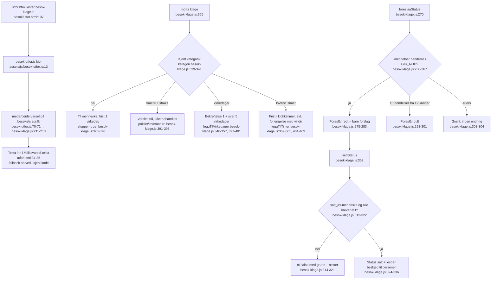
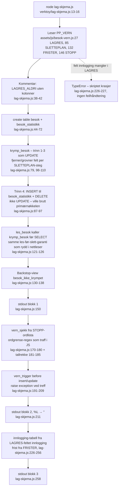

# Pathfinder fase 1 – del A: periferien

Tre flytskisser for det som ligger rundt kjernen: landingssiden og
demo-innloggingen, klagekanalen, og SQL-generatoren. Dato: 2026-08-24.

---

## 1. Landing og demo-innlogging

`besok/index.html` er en ren markedsside. Den laster kun `assets/js/app.js`
(index.html:185). `besok/logg-inn.html` er en demo-innlogging der hele
logikken ligger i et inline-skript (logg-inn.html:59–73).

```mermaid
flowchart TD
  A[Bruker åpner landing<br/>besok/index.html:1] --> B[app.js IIFE kjører<br/>assets/js/app.js:4]
  B --> C[Årstall fylles i bunntekst<br/>app.js:10-12]
  B --> D{Finnes .nav-toggle / #cookie-banner?<br/>app.js:29 og 82}
  D -- nei, på denne siden --> E[Ingen localStorage røres<br/>app.js:43-47 nås ikke]
  A --> F{Valg på siden}
  F -- Prøv demoen --> G[oversikt.html<br/>index.html:67]
  F -- Be om pilotpris --> H[mailto:post@naviar.no<br/>index.html:136]

  I[Bruker åpner logg-inn<br/>besok/logg-inn.html:1] --> J[Laster besok-lager + besok-vern<br/>logg-inn.html:57-58<br/>ingen kall ved lasting]
  I --> K[DOMContentLoaded<br/>logg-inn.html:60]
  K --> L[Submit på skjema<br/>logg-inn.html:62]
  L --> M{E-post gyldig?<br/>regex logg-inn.html:65}
  M -- nei --> N[Feilmelding vises + fokus<br/>logg-inn.html:66-67]
  N --> L
  M -- ja --> O[Skjema skjules, «sjekk e-posten» vises<br/>logg-inn.html:68-70<br/>ingenting lagres, ingen e-post sendes]
  O --> P[Demo: fortsett uten e-post<br/>logg-inn.html:47 → oversikt.html]
```

**Sideeffekter:** Ingen. Inline-skriptet rører verken localStorage eller
sessionStorage – «innloggingen» er ren DOM-veksling. `app.js` skriver
`pp_cookie_consent_v1` (app.js:7, 59) bare på sider som har
`#cookie-banner`, og det har ingen av disse to sidene.

**Feilgrener:** Én: ugyldig e-post → `.show` på feilteksten og fokus tilbake
(logg-inn.html:66–67). Ingen nettverkskall som kan feile.

---

## 2. Klagekanalen – PP_KLAGE

`assets/js/besok-klage.js` er et regelbibliotek (IIFE → `window.PP_KLAGE`,
besok-klage.js:26). Fra skjermene brukes bare én funksjon:
`medarbeidervarsel()` i arbeiderens rapportskjerm. Resten (`motta`,
`foreslaaStatus`, `settStatus`, `status`) er kun i bruk fra enhetstestene
(tests/enhet.test.js:704).



**Sideeffekter:** Ingen. PP_KLAGE lagrer ingenting – all persistens er
kallerens ansvar; modulen returnerer bare objekter.

**Feilgrener:** Ukjent kategori ruter til et menneske med stopp
(besok-klage.js:368–376); `settStatus` nekter uten navngitt menneske eller
manglende obligatoriske felt (besok-klage.js:313–322); ukjent språkkode
faller tilbake til norsk (besok-klage.js:212).

---

## 3. SQL-generatoren – verktoy/lag-skjema.js

Kjøres for hånd: `node verktoy/lag-skjema.js > sql/001-besok.sql`
(lag-skjema.js:11). Skriptet skriver alt til stdout i tre blokker
(lag-skjema.js:150, 211, 258) – selve fila skapes av shell-omdirigeringen.
Kilden er `window.PP_VERN` fra `assets/js/besok-vern.js`, lastet via
`global.window`-triks (lag-skjema.js:13–16).



**Sideeffekter:** Skriver bare til stdout; `sql/001-besok.sql` oppstår ved
omdirigering. Verifisert 2026-08-24: regenerert utdata er byte-likt den
innsjekkede `sql/001-besok.sql` (11 372 byte).

**Feilgrener:** Ingen eksplisitte. Fjernes `innlogging`-feltet fra
`PP_VERN.LAGRES`, krasjer skriptet med TypeError på lag-skjema.js:227 –
en hard stopp, men uten forklarende melding. Kolonnenavn utenfor
`KOLONNE`-kartet får automatisk snake_case-fallback (lag-skjema.js:28).

---

## Rapportkontrakt

### Kilder

| Fil | Lest |
|---|---|
| `/home/user/BETA-ART/besok/index.html` | 1–187 (hele) |
| `/home/user/BETA-ART/besok/logg-inn.html` | 1–75 (hele; inline-skript 59–73) |
| `/home/user/BETA-ART/assets/js/app.js` | 1–118 (hele) |
| `/home/user/BETA-ART/assets/js/besok-klage.js` | 1–448 (hele) |
| `/home/user/BETA-ART/besok/utfor.html` | 80–110 + linje 34–35 via grep |
| `/home/user/BETA-ART/assets/js/besok-utfor.js` | 1–170 (hele) |
| `/home/user/BETA-ART/verktoy/lag-skjema.js` | 1–258 (hele) |
| `/home/user/BETA-ART/assets/js/besok-vern.js` | 85–131 + struktur via grep (27, 43, 132, 146, 205) |
| `/home/user/BETA-ART/assets/js/besok-lager.js` | 160–200 + grep (nøkkel `pp_besok_v1`:16) |
| `/home/user/BETA-ART/sql/001-besok.sql` | eksistens + diff mot regenerert utdata |

### Konkrete funn

1. **Demo-innloggingen lagrer ingenting.** Inline-skriptet
   (logg-inn.html:59–73) veksler bare DOM; ingen sesjon opprettes, og
   `oversikt.html` er direkte nåbar uten å gå via innlogging. Landingssiden
   lenker for øvrig aldri til `logg-inn.html` – siden nås bare med direkte URL.
2. **logg-inn.html laster to moduler den ikke bruker** (besok-lager.js og
   besok-vern.js, logg-inn.html:57–58). Begge er passive IIFE-er ved lasting,
   så det er harmløst, men dødvekt.
3. **app.js er nesten inert på besok-sidene.** Cookie-banner og nav-toggle
   finnes ikke i besok-malen, så bare årstallsutfyllingen (app.js:10–12)
   gjør noe. `pp_cookie_consent_v1` skrives aldri herfra.
4. **PP_KLAGE er 448 linjer, men skjermene bruker én funksjon:**
   `medarbeidervarsel()` (besok-utfor.js:70–71). `motta`, `foreslaaStatus`,
   `settStatus` og `status` er kun koblet til enhetstestene
   (tests/enhet.test.js:704) – klagemottak har ingen UI ennå, selv om
   KANALER (besok-klage.js:425–430) beskriver fire kanaler.
5. **Generatoren holder én sannhet.** Skjema, krympetrigger, ordliste-sperre
   og innloggingsfrist utledes alle av PP_VERN-data; regenerering i dag gir
   byte-likt resultat mot innsjekket `sql/001-besok.sql`.
6. **Trinn 4 i krympingen er flytting, ikke nulling** (lag-skjema.js:84–97):
   raden går til `besok_statistikk` (måned + utfall) og slettes – med
   begrunnelsen at nulling ville brutt primærnøkkelen og fjernet datoen
   krympingen selv leser.
7. **Sperra gjenskapes i databasen:** `vern_sjekk`/`vern_trigger`
   (lag-skjema.js:165–209) speiler `PP_VERN.sjekk()` sitt ordgrensemønster og
   11-siffer-regelen, slik at frontend-sperra ikke kan omgås med et direkte
   insert.

### Tillitsnotat

Høy tillit til del 1 og 3: alle filer lest i sin helhet, og generatorens
utdata er verifisert ved kjøring og diff (LIKT). Del 2 er høy tillit på
kodenivå; bruksbildet (at bare `medarbeidervarsel` brukes) er verifisert med
grep over hele repoet på `PP_KLAGE`.

**Hull:**
- `besok-vern.js` er bare lest i utdrag (SLETTEPLAN-delen); `sjekk()` og
  `krymp()` sin indre logikk er ikke gjennomgått her – de tilhører kjernen,
  ikke periferien.
- E2E-testene (tests/e2e.test.js) er ikke lest; om de dekker logg-inn-flyten
  er ikke undersøkt.
- SQL-en er verifisert som identisk med generatorens utdata, men ikke kjørt
  mot en faktisk Postgres – regex-syntaksen i `vern_sjekk` er ikke prøvd.
- Ett-fils-varianten (`window.PP_ENFIL`/`__ppToken`, besok-utfor.js:18, 169)
  er nevnt i koden, men hvilken side som setter den er ikke kartlagt.
