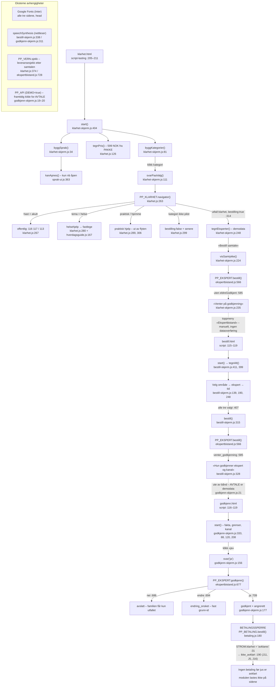

# KLARHET 45 – flytdiagram (Pathfinder fase 1, 2026-08-24)

Sporer KLARHET 45-tjenesten fra forsiden `klarhet.html`, gjennom
familiens bestilling i `bestill.html`, til den eldres godkjenning i
`godkjenn.html` – gjennom de faktiske funksjonene i koden. Alle
fil:linje-referanser er lest, ikke antatt.

## Kilder (faktisk lest)

| Fil | Linjeområde |
|---|---|
| `/home/user/BETA-ART/klarhet.html` | 26–47, 115–145, 155–211 (script-lasting :205–211) |
| `/home/user/BETA-ART/bestill.html` | 9–34, 67–69, 115–119 (script-lasting) |
| `/home/user/BETA-ART/godkjenn.html` | 6–25, 116–119 (script-lasting) |
| `/home/user/BETA-ART/assets/js/klarhet-skjerm.js` | 1–431 (hele) |
| `/home/user/BETA-ART/assets/js/bestill-skjerm.js` | 1–427 (hele) |
| `/home/user/BETA-ART/assets/js/godkjenn-skjerm.js` | 1–358 (hele) |
| `/home/user/BETA-ART/assets/js/klarhet.js` | 1–408 (hele, PP_KLARHET) |
| `/home/user/BETA-ART/assets/js/ekspertbistand.js` | 1–772 (hele, PP_EKSPERT) |
| `/home/user/BETA-ART/assets/js/sprak-ui.js` | 1–405 (hele, PP_SPRAK_UI) |
| `/home/user/BETA-ART/assets/js/hverdagsguide.js` | 1–45, 165–175 (PP_GUIDE: header, `henvisning`, `STI`) |
| `/home/user/BETA-ART/assets/js/betaling.js` | 1–72, 155–224 (PP_BETALING: strømmer og `bestill`-porten) |
| `/home/user/BETA-ART/assets/js/besok-lager.js` | kun :16 (`NOKKEL`) og :166–192 (grep, localStorage) |
| `/home/user/BETA-ART/assets/js/besok-vern.js` | kun :22, :205 (grep, `PP_VERN.sjekk`) |

## Den lykkelige stien, i tekst

1. **Forsiden lastes** – `klarhet.html:205–211` laster modulene i rekkefølge:
   vern → lager → guide → språk → ekspert → klarhet → skjerm. Skjermen
   (`klarhet-skjerm.js`) kjører `start()` (`:404–421`) på DOMContentLoaded
   (`:423–427`): `byggSprak` (`:34`), `byggFaner` (`:344`), `byggKategorier`
   (`:81`), `tegnUtvalg` (`:264`), `tegnSteg` (`:274`), `tegnPris` (`:298`,
   pris fra `PP_KLARHET.PAKKE`, `klarhet.js:126–138`: 599 NOK, 449 til
   ekspert), `tegnAkutt` (`:308`), `tegnSporsmaal` (`:389`, lenker til
   `PP_GUIDE.STI`, `hverdagsguide.js:171`). Registreringen
   `window.PP_RUTER['klarhet'] = start` står på `klarhet-skjerm.js:429`,
   men er en no-op på siden: ingen av modulene som lastes her definerer
   `PP_RUTER` (bare besøks-/hjelperskjermene gjør det).
2. **Navigator** – kunden klikker en kategori (`byggKategorier`-klikk
   `:100–104`) → `svarPaaValg(katId)` (`:111–137`) →
   `PP_KLARHET.navigator({tema, hast:'uker', form:'telefon', sprak})`
   (`klarhet.js:263–320`). Lykkelig utfall: `{utfall:'klarhet',
   bestilling:true, gjorIkke: k.girIkkeRett}` (`:314–319`) – grensene vises
   i svaret (`klarhet-skjerm.js:128–133`), bestillkortet vises (`:135`,
   `klarhet.html:126–136`) og `tegnEksperter(katId)` (`:248–262`) tegner
   demodata-ekspertene (`DEMO`, `:144–163`).
3. **«Bestill samtale» på forsiden stopper med vilje** – knappen (`:212–215`)
   → `visSamtykke(e)` (`:224–246`) → `PP_EKSPERT.bestill({kategori, kanal,
   minutter, pris})` (`ekspertbistand.js:566–592`) **uten**
   `eldreGodkjent:true` → `{ok:false, regel:'venter_godkjenning',
   mangler:['hvilken ekspert','hvilken kanal']}` (`:585–588`, fra
   `SAMTYKKE`, `:424–429`). Skjermen viser «Venter på godkjenning» og hva
   den eldre godkjenner (`klarhet-skjerm.js:235–244`).
4. **Bestillingssiden** – `bestill.html` (nås via toppmenyen
   «Ekspertbistand», `bestill.html:30`; ingen automatisk overføring av
   valget fra forsiden). `bestill-skjerm.js` `start()` (`:411–417`) →
   `tegnAlt()` (`:399–409`). Tre trinn (`TRINN`, `:100–104`): fagområde
   (`tegnOmraader`, `:139–167`, kategorier fra `E.pilotKategorier()`,
   `ekspertbistand.js:488–490`), ekspert (`tegnEksperter`, `:190–246`, egen
   `DEMO`-liste `:69–82`), tid (`tidsvalg`, `:248–273`). Knappen `#bestill`
   er deaktivert til alle tre er valgt (`:407–408`).
5. **Bestill-klikket** – `bestill()` (`bestill-skjerm.js:315–332`) kaller
   `PP_EKSPERT.bestill` på nytt, fortsatt uten `eldreGodkjent` → samme
   `venter_godkjenning`, og `#venter` viser «… Hun godkjenner hvilken
   ekspert og hvilken kanal.» (`:328–330`). Det er flytens riktige
   sluttpunkt for familien: avtalen står som «venter»
   (`SAMTYKKE.utenGodkjenning`, `ekspertbistand.js:428`).
6. **Den eldres skjerm** – `godkjenn.html` er en egen inngang (ingen lenke
   fra `bestill.html`; avtalen `AVTALE` er demodata,
   `godkjenn-skjerm.js:21–29`, «senere kommer den fra PP_API»). `start()`
   (`:333–348`) tegner hvem som spør (`tegnFra` `:149`, `tegnPerson`
   `:72`), fire fakta inkl. pris «599 kr – Lars betaler» (`tegnFakta`
   `:88–115`), grensene med hennes ord (`tegnGrenser` `:120–147`,
   `kanHjelpeDegMed`/`girIkkeRett` fra kategorien), kanalvalg (`tegnKanal`
   `:208–246`, fra `E.TILGJENGELIGHET`, `ekspertbistand.js:614–642`) og
   annen-tid-grunner (`tegnEndre` `:253–268`, faste valg, ingen fritekst).
7. **Ja-et** – `#ja`-klikk (`:346`) → `svar('ja')` (`:156–197`) →
   `PP_EKSPERT.godkjenn({svar:'ja', ekspert, kanal, sprak})`
   (`ekspertbistand.js:677–714`) → `{ok:true, tilstand:'godkjent', angre:
   'Hun kan avlyse fram til samtalen starter …'}` (`:709–713`). Skjermen
   viser «Takk. Da er det avtalt.» med angreretten (`godkjenn-skjerm.js:
   177–182`). Bytter hun kanal etter et ja, kjøres `svar('ja')` på nytt for
   den nye kanalen (`:236–239`).

## Betalingssperren – hvor den slår inn

Ingen av de tre skjermene har et betalingssteg; prisen **vises** overalt,
men penger flyttes aldri. Sperren ligger i to lag:

1. **Bestillingsporten**: `PP_EKSPERT.bestill` krever at prisen står
   (`ekspertbistand.js:582–584`, regel `pris`) og nekter uten den eldres
   godkjenning (`:585–588`) – men tar aldri betaling.
2. **Jus-sperren**: `PP_BETALING` (`betaling.js`) – som **ikke lastes på
   noen av de tre sidene** – holder klarhet-strømmen stengt:
   `STROM.klarhet.tilstand = 'avklares'` (`betaling.js:31–41`) med kravene
   J11 (betalingsformidling 599 inn / 449 ut), J5 (angrerett ved
   fjernsalg), J16 (mva som flytter 25 %) og arbeidsrettslig
   klassifisering. Porten `PP_BETALING.bestill()` (`:180–215`) returnerer
   `{ok:false, regel:'ikke_avklart', krever:[…]}` for strømmen (`:190–194`).
   Kommentaren `betaling.js:17–19` sier det rett ut: portene «åpnes av en
   jurist, ikke av en integrasjon», og `bestill()` nekter så lenge.
   Speiles i `PP_EKSPERT.UAVKLART` (`ekspertbistand.js:455–471`):
   tilknytning, andel og mva er alle `avklart: false`.

## Sideeffekter

- **localStorage: ingen i denne flyten.** Eneste localStorage-bruk i de
  lastede modulene er `besok-lager.js` (nøkkel `pp_besok_v1`, `:16`), som
  lastes på `klarhet.html:206` men aldri kalles av klarhet-skjermen.
  `bestill.html` og `godkjenn.html` laster den ikke.
- **Språkvalget følger personen som regelmodell, ikke som lagring.**
  Valget holdes i en modul-lokal variabel per side (`valgtSprak`
  `klarhet-skjerm.js:19`; `sprak` `bestill-skjerm.js:21` og
  `godkjenn-skjerm.js:31`) og persisteres ikke – det overlever ikke et
  sidebytte i demoen. Regelen om at valget skal følge med ut finnes i
  `PP_SPRAK_UI.FLATER` (`sprak-ui.js:48`: nettside, bestilling, sms,
  epost, oppsummering) og `melding()` (`:385–389`), og språket sendes med
  i navigator-svaret (`klarhet.js:318`) og godkjenningssvaret
  (`ekspertbistand.js:711`).
- **Språkgaten**: `kanApnes()` (`sprak-ui.js:363–381`) slipper bare
  gjennom språk der alle strenger finnes, nødnumrene 116 117/113 står i
  akuttsetningen, og et menneske har lest den (`GODKJENT = {nb: true}`,
  `:336`). I dag er bare norsk åpent → nedtrekket skjules på forsiden
  (`klarhet-skjerm.js:48–55`) og deaktiveres på de to andre
  (`bestill-skjerm.js:374–377`, `godkjenn-skjerm.js:283–286`).
- **DOM**: språkbytte setter `document.documentElement.lang`/`dir`
  (`klarhet-skjerm.js:66–67` m.fl.).
- **Opplesning**: `speechSynthesis` i nettleseren (`bestill-skjerm.js:
  338–358`, `godkjenn-skjerm.js:311–331`) – lokal, ingen lyd forlater
  maskinen.

## Feilgrener (kort)

| Gren | Hvor | Utfall |
|---|---|---|
| Det haster nå | `klarhet.js:267–272` | `offentlig`, ingen bestilling; 116 117 / 113 fra `E.AKUTTVARSEL` |
| Helse/medisin | `klarhet.js:280–287` | `helsehjelp`, selger ikke; henviser fastlege via `PP_GUIDE.henvisning('medisin')` |
| Praktisk / «noen må komme hjem» | `klarhet.js:289–294, 306–312` | `praktisk` – ut av Klarhet-flyten |
| Kategori ikke i pilot | `klarhet.js:299–302` | `bestilling:false` med `k.senere`-begrunnelse |
| Ugyldig bestilling | `ekspertbistand.js:566–584` | `ukjent_fagomrade`, `kanal`, `ikke_apen`, `lengde`, `pris` – alltid med grunn, kaster aldri |
| Den eldre sier nei | `ekspertbistand.js:686–691` | `avslatt`; familien får kun «Avtalen ble ikke noe av.» – grunnen er hennes |
| Den eldre vil endre | `ekspertbistand.js:694–698` | `endring_onsket` med fast grunn-id (`ANNEN_TID.grunner`, `:650–661`) |
| Ja uten ekspert/kanal | `ekspertbistand.js:703–707` | tilbake til `venter` |
| Modul mangler | skjermene `:16`/`:18`/`:17` | hele IIFE-en returnerer stille – tom skjerm |
| Ingen eksperter i kategori | `klarhet-skjerm.js:256–260`, `bestill-skjerm.js:201–205` | «Ingen ledige tider …» – aldri påfunnet knapphet (`ALDRI_SELG`, `klarhet.js:327–336`) |

## Flytdiagram

## Tillitsnotat og hull

**Tillit: høy** for selve flyten – de tre skjermfilene og de fire
regelmodulene er lest i sin helhet, og hver pil i diagrammet peker på en
lest linje. `hverdagsguide.js`, `betaling.js`, `besok-vern.js` og
`besok-lager.js` er lest delvis/via grep, kun for de funksjonene flyten
berører.

Hull og funn for fase 2:

1. **Ingen datakobling mellom sidene.** Forside → bestilling → godkjenning
   henger sammen som regelverk (samme `PP_EKSPERT.bestill`/`godkjenn`),
   men ikke som data: valget på forsiden følger ikke med til
   `bestill.html`, og `godkjenn.html` viser hardkodet `AVTALE`
   (`godkjenn-skjerm.js:21–29`). Besøksflyten har token-lenker
   (`utfor.html?t=…`); Klarhet-flyten har ingen tilsvarende mekanisme.
2. **`PP_RUTER`-registreringene er døde på egne sider** (`klarhet-skjerm.js:429`,
   `bestill-skjerm.js:425`, `godkjenn-skjerm.js:357`): ingen modul på disse
   sidene definerer `window.PP_RUTER`, så guarden gjør registreringen til
   en no-op. Verdi kun i en kontekst som definerer ruteren først
   (test/SPA).
3. **To ulike `DEMO`-ekspertlister** med delvis ulike navn
   (`klarhet-skjerm.js:144–163` vs `bestill-skjerm.js:69–82`) – duplisert
   concern, kandidat for samling i fase 2.
4. **Språkvalget persisteres ikke** – «følger personen» er i dag en
   regelmodell (`FLATER`, `melding()`) uten lagring; hver side starter på
   `nb`.
5. **Betalingssperren håndheves ved fravær**: `betaling.js` lastes ikke av
   noen side, og skjermene har ikke noe betalingssteg å sperre. Regelen er
   dermed umulig å omgå fra flaten, men også usynlig for den som leser bare
   skjermkoden – porten står i `PP_BETALING.bestill` (`betaling.js:180`).
6. **Duplisert visSamtykke/bestill-mønster**: forsiden (`visSamtykke`) og
   bestillingssiden (`bestill`) kaller samme regel og formaterer samme
   avslag på to ulike måter – liten, men reell duplisering.
