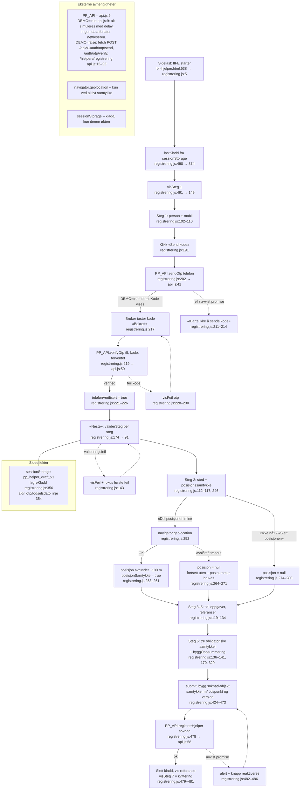
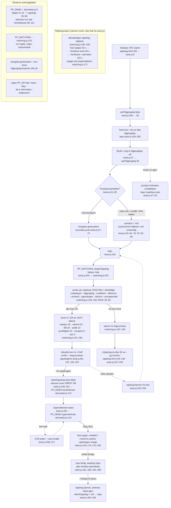

# Pathfinder fase 1 – flyt C: Hjelperregistrering og oppdragstavla

> **Merk:** Begge flytene er bygget på markedsplass-v2-grunnlaget (hjelpere som
> registrerer seg selv, oppdrag som tilbys i bølger). Se `docs/JURIDISK-GRENSE.md`
> og CLAUDE.md kap. 6 for dokumenttilstander – dette dokumentet beskriver koden
> slik den faktisk står i dag, uavhengig av modellbyttet.

Dato: 2026-08-24 · Kartlagt fra kildekoden, ikke fra kjøring.

---

## 1. HJELPERREGISTRERING v1

**Inngang:** `bli-hjelper.html:538` laster `assets/js/registrering.js` (etter
`api.js` på linje 537). Modulen er en IIFE som avbryter hvis `#helper-form`
ikke finnes (`registrering.js:8–9`).

**Primær lykkelig sti:** 6 steg med validering per steg (`validerSteg`,
`registrering.js:91–145`) → OTP-verifisering av mobil i steg 1 → frivillig
posisjonssamtykke i steg 2 → oppsummering bygges ved steg 6
(`byggOppsummering`, `registrering.js:329–350`) → `submit` bygger
`soknad`-objektet (`registrering.js:428–473`) → `PP_API.registrerHjelper`
(`api.js:58–64`) → kvittering (steg 7) med referansenummer.

**Sideeffekter:** kladd i `sessionStorage` under nøkkelen
`pp_helper_draft_v1` ved hver `input`/`change` og ved «Neste»
(`lagreKladd`, `registrering.js:356–372`; lyttere linje 400–401), lastes ved
oppstart (`lastKladd`, `registrering.js:374–398`, kalt linje 490). OTP og
fødselsdato lagres aldri i kladden (`IKKE_LAGRE`, linje 354). Kladden slettes
ved vellykket innsending (linje 479).

**Feilgrener (kort):** ugyldig mobilnummer stopper OTP-utsending lokalt
(`registrering.js:193–197`); feil OTP setter `telefonVerifisert = false`;
steg 1 kan ikke passeres uten verifisert telefon (`registrering.js:109`);
avslått geolokasjon er *ikke* en feil – flyten fortsetter eksplisitt uten
(«postnummer-fallback»); nettverksfeil ved innsending reaktiverer knappen og
beholder kladden.

---

## 2. OPPDRAGSTAVLA

**Inngang:** `oppdrag.html:156` laster `assets/js/tavle.js` (etter
`matching.js` linje 154 og `demodata.js` linje 155). Oppstart:
`settTilgjengelig(false)` (`tavle.js:309`) – tavla starter alltid *av*.

**Primær lykkelig sti:** bryteren «Jeg er tilgjengelig» slås på
(`tavle.js:57–59` → `settTilgjengelig`, linje 39–55) → valgfritt
posisjonssamtykke (`tavle.js:61–80`; uten samtykke brukes postnummer,
linje 82–85) → `tegn()` (`tavle.js:193–236`) kaller
`PP_MATCHING.rangerOppdrag(hjelper, oppdragsliste)` (`tavle.js:203` →
`matching.js:203–213`) → aktuelle oppdrag rendres som kort med score og
begrunnelser (`oppdragKort`, `tavle.js:89–123`), skjulte oppdrag rendres i
«Oppdrag du ikke får se – og hvorfor» (`oppdrag.html:129–136`,
`tavle.js:227–235`) → «Ta oppdraget» (`tavle.js:246–251`) → adresse hentes
først nå via `PP_DEMO.hentAdresse` (`tavle.js:126` → `demodata.js:112`) →
oppmøtekode 4821 sjekkes inn (`tavle.js:261–273`,
`PP_DEMO.oppmoteKode` `demodata.js:113`) → «Meld ferdig» (`tavle.js:294–298`)
→ tilbake til tavla; oppdraget fjernes og adressen skjules igjen
(`tavle.js:300–305`).

**Matchingmotoren** (`matching.js`, `window.PP_MATCHING` eksponert linje
215–222):

- **KRAV** (`matching.js:20–83`) er filtre, ikke poeng – bryter et oppdrag ett
  krav, tilbys det aldri, og `vurder()` returnerer `sperre` med begrunnelse
  (`matching.js:129–139`). Rekkefølge: `rodkategori` (helsehjelp/penger
  formidles aldri, linje 21–28), `tilgjengelig` (30–33), `kvalifisert`
  (35–38), `tillitsniva` (40–46), `avstand` (48–53), `egenskaper`
  (familiens faste krav, f.eks. ikke-røyker; linje 55–71), `tidsrom` (73–76),
  `proveperiode` (kun lav risiko på dagtid, linje 78–82).
- **VEKT** (`matching.js:88–96`, sum 100): relasjon 25, nærhet 25, tillit 20,
  språk 10, punktlighet 10, transport 5, pris 5. Delscorene beregnes i
  `vurder()` (`matching.js:141–152`) med hjelpefunksjonene `naerhetsScore`
  (100), `relasjonsScore` (106, metter ved ~10 oppdrag), `transportScore`
  (112) og `prisScore` (120).
- **Tilbudsbølger** (`tilbudsbolger`, `matching.js:184–200`): Fast hjelper
  (`ventetidSek: 60`) → Familiens krets (`ventetidSek: 90`) → Verifiserte
  hjelpere i nærheten (`ventetidSek: 120`). Bygger på `rangerHjelpere`
  (`matching.js:172–177`). **Merk:** `tilbudsbolger` kalles ikke fra
  `tavle.js` – tavla bruker kun `rangerOppdrag`; bølgene er tildelingssiden
  av samme motor (brukt fra driftskonsollen/backend-perspektivet).

**Sideeffekter:** ingen lagring – tavla holder all tilstand i minnet
(`posisjon`, `aktivtOppdrag`, filtrert `oppdragsliste`). Bryter av =
posisjonen forkastes med én gang (`tavle.js:47–53`). «Meld fra om forespørsel
utenfor oppdraget» (`tavle.js:156–178`, `280–292`) setter bare
`aktivtOppdrag.utenfor` lokalt; kommentaren på linje 285 sier at produksjon
skal sende eget varsel til drift.

**Feilgrener (kort):** geolokasjon utilgjengelig/avslått → postnummer-fallback
med tekstlig forklaring; feil oppmøtekode → feilmelding, ny inntasting; tom
resultatliste → «Ingen oppdrag akkurat nå» (`tavle.js:215–219`).

---

## Rapportkontrakt

### Kilder (linjeområder lest i sin helhet)

| Fil | Lest | Nøkkelområder |
|---|---|---|
| `/home/user/BETA-ART/bli-hjelper.html` | 520–541 | script-rekkefølge 536–538 |
| `/home/user/BETA-ART/assets/js/registrering.js` | 1–493 (hele) | validerSteg 91–145 · OTP 184–232 · posisjon 234–280 · kladd 352–420 · submit 422–487 |
| `/home/user/BETA-ART/assets/js/api.js` | 1–67 (hele) | DEMO 9 · post 12–22 · sendOtp 41–47 · verifyOtp 50–55 · registrerHjelper 58–64 |
| `/home/user/BETA-ART/oppdrag.html` | 100–159 | skjulte-kort 129–136 · script-rekkefølge 153–156 |
| `/home/user/BETA-ART/assets/js/tavle.js` | 1–311 (hele) | settTilgjengelig 39–55 · posisjon 61–85 · tegn 193–236 · aktivDel 125–191 · handlinger 245–306 |
| `/home/user/BETA-ART/assets/js/matching.js` | 1–224 (hele) | KRAV 20–83 · VEKT 88–96 · vurder 129–169 · rangerHjelpere 172–177 · tilbudsbolger 184–200 · rangerOppdrag 203–213 |
| `/home/user/BETA-ART/assets/js/demodata.js` | 1–116 (hele) | hjelper 8–23 · oppdrag 25–96 · adresser 99–107 · hentAdresse/oppmoteKode 112–113 |

### Konkrete kallsteder

- `registrering.js:202` → `window.PP_API.sendOtp` (`api.js:41`)
- `registrering.js:219` → `window.PP_API.verifyOtp` (`api.js:50`)
- `registrering.js:478` → `window.PP_API.registrerHjelper` (`api.js:58`)
- `tavle.js:12–13` → `window.PP_DEMO.hjelper` / `.oppdrag` (`demodata.js:110–111`)
- `tavle.js:203` → `window.PP_MATCHING.rangerOppdrag` (`matching.js:203`)
- `tavle.js:126` → `window.PP_DEMO.hentAdresse` (`demodata.js:112`)
- `tavle.js:264` → `window.PP_DEMO.oppmoteKode` (`demodata.js:113`)
- Ikke kalt fra disse skjermene: `PP_MATCHING.vurder` (direkte),
  `rangerHjelpere`, `tilbudsbolger` – eksponert `matching.js:215–222` for
  tildelingssiden.

### Tillitsnotat

**Høy tillit:** Alle fem JS-filene er lest i sin helhet; linjenumre er tatt
direkte fra lesningene, ikke fra søketreff. HTML er lest rundt de oppgitte
forankringene og bekrefter script-rekkefølgen (api før registrering; matching
og demodata før tavle). Kartleggingen er statisk – koden er ikke kjørt i
denne økten, men flytene er lineære IIFE-er uten dynamisk lasting.

**Hull / forbehold:**

1. `bli-hjelper.html` er kun lest 520–541. Skjemaets fieldsets (steg 1–7),
   feltnavn og `data-error-for`-strukturen er utledet fra
   `registrering.js`, ikke verifisert mot HTML-en linje for linje.
2. `oppdrag.html` er kun lest 100–159; bryteren og posisjonsboksen (linjer
   < 100) er utledet fra id-ene `tavle.js` slår opp.
3. `tilbudsbolger` med `ventetidSek` har ingen kallsted i de kartlagte
   skjermene – hvem som faktisk kaller den (driftskonsollen `drift.html`?
   tester?) er ikke kartlagt i denne flyten.
4. `assets/js/app.js` (lastet på begge sider) er ikke lest – antatt felles
   side-oppsett (cookie-banner, årstall) uten betydning for flytene.
5. Markedsplass-v2-forbeholdet: hjelper-selvregistrering og tilbudsbølger
   forutsetter markedsplassmodellen; B2B-modellens forhold til disse
   skjermene er ikke vurdert her (fase 1 kartlegger, fase 2 vurderer).
