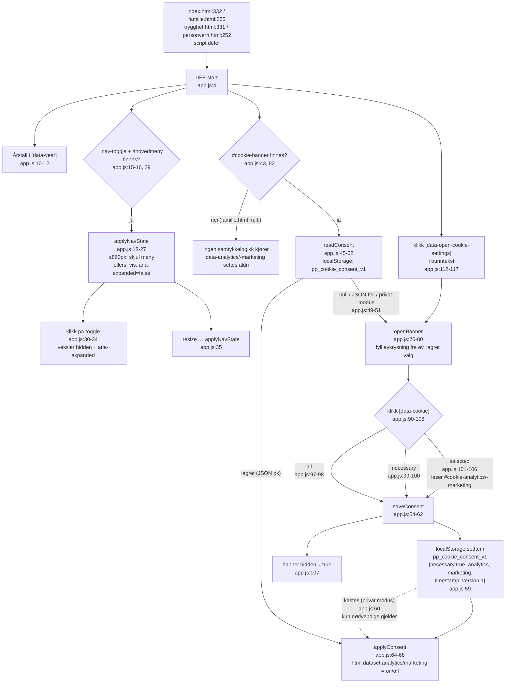
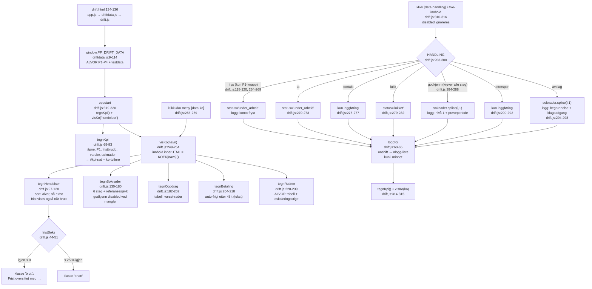

# Flytskisser C – Infosidene og driftskonsollen

Pathfinder fase 1, 2026-08-24. To skisser: felles skript for informasjonssidene
(`app.js`) og driftskonsollen (`drift.js` + `driftdata.js`).

## Kilder

| Fil | Linjeområde | Rolle |
|---|---|---|
| `assets/js/app.js` | 1–118 (hele) | Felles: årstall, mobilmeny, samtykke |
| `index.html` | 305–330 (banner), 332 (script) | Forside med samtykkebanner |
| `trygghet.html` | 313, 331 | Banner + app.js |
| `personvern.html` | 234, 252 | Banner + app.js |
| `familie.html` | 255 | Kun app.js – **ingen banner** |
| `drift.html` | 110–128 (kpi/kø/logg-DOM), 134–136 (script) | Konsollens skall |
| `assets/js/drift.js` | 1–321 (hele) | Køer, handlinger, logg |
| `assets/js/driftdata.js` | 1–114 (hele) | `window.PP_DRIFT_DATA`, testdata |

## Del 1: Infosidene – app.js

`app.js` er én IIFE uten eksponert API. Tre uavhengige deler: årstall i
bunntekst, mobilmeny og samtykke til informasjonskapsler.

**Sideeffekter (del 1):**
- `localStorage`-nøkkel: `pp_cookie_consent_v1` – JSON med `necessary` (alltid
  `true`), `analytics`, `marketing`, `timestamp` (ISO), `version: 1`
  (app.js:54–59). Tre kategorier; nødvendige kan ikke velges bort
  (index.html:313, app.js:55).
- DOM: `document.documentElement.dataset.analytics/marketing` settes til
  `on`/`off` (app.js:66–67) – kroken for framtidige sporingsskript; ingen
  sporing lastes i dag.

**Feilgrener:** `localStorage`-lesing og -skriving er pakket i try/catch –
korrupt JSON gir `null` (banner vises på nytt), skrivefeil i privat modus
svelges og kun nødvendige gjelder (app.js:49–51, 60).

## Del 2: Driftskonsollen – drift.js + driftdata.js

`driftdata.js` må lastes før `drift.js` (drift.html:135–136); den eksponerer
`window.PP_DRIFT_DATA` med `ALVOR` (P1–P4 med frister 15/60/1440/4320 min,
driftdata.js:13–18), `hendelser`, `soknader`, `aktiveOppdrag`,
`betalingssaker` og `referansesporsmal`. Alt er testdata i minnet – ingenting
lagres, og refresh nullstiller.

**Sideeffekter (del 2):** Ingen. All tilstand (`logg`, statusendringer,
`splice` av søknader) lever i minnet i `D`-objektet; ingen `localStorage`,
ingen nettverkskall. All tekst escapes med `esc()` (drift.js:24–28) før
`innerHTML`.

**Feilgrener:** Tomme køer gir «Ingen åpne hendelser» / «Ingen søknader i kø»
(drift.js:99, 131). Godkjenn-knappen er `disabled` til alle seks steg er
fullført (drift.js:168–169), og klikk på disabled ignoreres (drift.js:312).
Oversittet frist er en synlig tilstand, ikke en feil (drift.js:47–48).

## Konkrete funn

1. **Banner mangler på familie.html** (og trenger-hjelp.html, oppdrag.html,
   besok/index.html): sidene laster `app.js`, men uten `#cookie-banner`
   hopper hele samtykkeblokken over (app.js:82). Konsekvens:
   `data-analytics`/`data-marketing` settes aldri på disse sidene, selv når
   samtykke er lagret fra forsiden. Ufarlig i dag (ingen sporing lastes), men
   en felle den dagen kroken i app.js:65 tas i bruk.
2. **`finnSoknadIndeks` kan gi -1** (drift.js:305–308); `godkjenn`/`avslag`
   ville da gjort `splice(-1,1)` og fjernet feil søknad. Kan ikke inntreffe
   via UI-et (id kommer fra `data-id` i samme render), men er en latent felle
   ved gjenbruk. Tilsvarende gir `finnHendelse` `undefined` ved ukjent id.
3. **Drift-konsollen er ren demo**: handlingene endrer bare testdata i minnet;
   loggen tømmes ved refresh. Konsistent med `DEMO = true`-linjen i
   prosjektet, men verdt å merke i fase 2.
4. Samtykkeversjonering finnes (`version: 1` i nøkkelen `pp_cookie_consent_v1`),
   men ingen kode leser versjonen ennå – re-samtykke ved regelendring må
   bygges når det trengs.

## Tillitsnotat

Høy tillit: `app.js` (118 linjer), `drift.js` (321 linjer) og `driftdata.js`
(114 linjer) er lest i sin helhet; HTML-koblingene er verifisert med søk over
alle `.html`-filer.

**Hull:**
- Skissene er statisk lest, ikke kjørt i nettleser – rekkefølgeavhengigheten
  driftdata.js → drift.js er verifisert i markup, ikke i kjøring.
- CSS-klassene (`brutt`, `snart`, `p1`–`p4`) er ikke sjekket mot
  `assets/css/styles.css`.
- `bli-hjelper.html` har også banner + app.js (linje 518/536), men sidens
  eget innhold er ikke kartlagt her – den hører til en annen skisse.
- `docs/DRIFT.md` (rutinene konsollen henviser til, drift.js:237) er ikke
  lest; skissen dekker koden, ikke rutinedokumentet.
