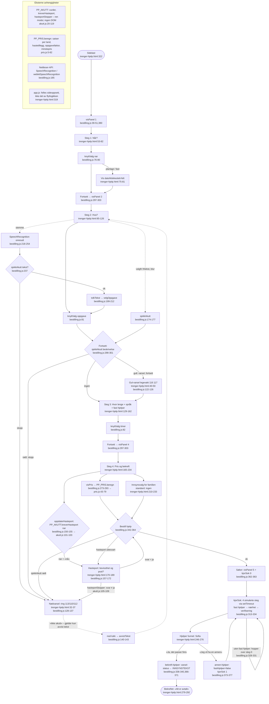

# Flyt C: Senior-bestillingsflyten (markedsplass-v2-grunnlaget)

> Skrevet for markedsplassen. Siden `trenger-hjelp.html` og modulene under hører til
> markedsplass-grunnlaget, ikke B2B-produktet vi selger nå. Kartlagt fordi
> akuttvurderingen og pris-før-bestilling-prinsippet gjenbrukes.

**Inngang:** `trenger-hjelp.html` laster `akutt.js` (linje 320), `pris.js` (linje 321)
og `bestilling.js` (linje 322). Hele flyten er én IIFE i `bestilling.js` som starter
med `visPanel(1)` (`bestilling.js:380`). Demo: ingen ekte bestilling opprettes, ingenting
lagres.

## Flytdiagram

## Hvor PP_AKUTT avbryter

`sjekkAkutt()` (`bestilling.js:114-138`) kalles fire steder og kan stoppe flyten:

1. **Blur på fritekst** (`bestilling.js:174-177`) – varsler, men blokkerer ikke navigasjon direkte.
2. **Fortsett fra steg 2** (`bestilling.js:298-301`) – rødt nivå returnerer `true` og stopper `visPanel`.
3. **Stemmeresultat** (`bestilling.js:237`) – rødt nivå hopper over intensjonstolkningen.
4. **Bestill-knappen** (`bestilling.js:345-346`) – siste kontroll, fordi teksten kan ha endret seg.

I tillegg to tekstuavhengige porter ved bestilling (`bestilling.js:348-359`):
hasteporten kreves ved hastegrad «nå» (`akutt.js:101-103`), og alt annet enn et
uttrykkelig «ja» stopper (`akutt.js:105-109`). Nivåene: RØDT stopper
(`akutt.js:24-52`), GULT spør men slipper videre (`akutt.js:55-64`). Avvisning av
et rødt varsel gjelder bare nøyaktig den avviste teksten (`avvistTekst`,
`bestilling.js:100,129-132,140-143`) – ikke resten av økten.

## Sideeffekter

- **Ingen lagring**: verken localStorage, `api.js` eller nettverk. Hele tilstanden er
  `valg`-objektet i minnet (`bestilling.js:15-25`); siden lastes på nytt → alt borte.
- **DOM**: panelbytte via `hidden` (`visPanel`), prislinjer skrives med `innerHTML`
  (`bestilling.js:291`), stemmetekst med `innerHTML` (`bestilling.js:233` – transkriptet
  interpoleres uescapet, lav risiko men verdt å merke).
- **Scroll**: `window.scrollTo` ved panelbytte (`bestilling.js:50`), `scrollIntoView`
  ved nød- og hasteportvarsler (`bestilling.js:136,167,351,356`).
- **Timere**: `kjorSok` simulerer matching med `setTimeout`-kjede (`bestilling.js:313-334`).
- **Mikrofon**: slås på kun ved trykk, av ved `onend` (`bestilling.js:218-254`).

## Feilgrener (kort)

- **Ingen `main .wrap`**: hele modulen returnerer stille (`bestilling.js:9-10`).
- **Tale ikke støttet**: knappen deaktiveres med henvisning til telefon (`bestilling.js:214-216`).
- **Talefeil** (`onerror`): melding «prøv igjen eller bruk knappene» (`bestilling.js:247-249`).
- **Neste uten valg**: `oppdaterNeste` holder knappen `disabled` (`bestilling.js:53-59`).
- **Ukjent land/oppgave i pris**: faller tilbake til `LAND.NO` / faktor 1; timer
  klemmes til minst 0,5 (`pris.js:44-50`).

## Kilder

| Fil | Linjeområde | Rolle |
|---|---|---|
| `/home/user/BETA-ART/trenger-hjelp.html` | 32-50 (varsler), 53-234 (steg 1-4), 170-189 (hasteport), 236-292 (søk/funnet/bekreftet), 319-322 (script-lasting) | Skjermene, 7 paneler |
| `/home/user/BETA-ART/assets/js/bestilling.js` | 1-381 (hele, lest i sin helhet) | Flytstyring, kobling til PP_AKUTT/PP_PRIS |
| `/home/user/BETA-ART/assets/js/akutt.js` | 24-52 (RØDT), 55-64 (GULT), 76-87 (`vurder`), 101-109 (hasteport) | Ren akuttvurdering, `window.PP_AKUTT` |
| `/home/user/BETA-ART/assets/js/pris.js` | 8-29 (satser/faktorer), 43-79 (`beregn`) | Pris før bestilling, `window.PP_PRIS` |

**Funksjonsnavn:** `visPanel`, `oppdaterNeste`, `knyttValg`, `sjekkAkutt`,
`oppdaterHasteport`, `tolkTekst`, `velgOppgave`, `erKveld`, `erHelg`, `visPris`,
`kjorSok`; `PP_AKUTT.vurder`, `PP_AKUTT.kreverHasteport`, `PP_AKUTT.hasteportStopper`;
`PP_PRIS.beregn`, `PP_PRIS.formater`.

## Tillitsnotat og hull

**Tillit: høy.** Alle fire kildefiler er lest i sin helhet; linjereferansene er tatt
direkte fra filene, ikke fra søketreff. Flyten er ikke kjørt i nettleser – diagrammet
bygger på statisk lesing, men koden er liten og uten indireksjon.

**Hull:**
- `app.js` er ikke lest (antatt felles sideoppsett; flyten refererer den ikke).
- Fritekstfeltet (`beskrivelse`) går ikke gjennom `PP_VERN.sjekk()` – konsistent med at
  ingenting lagres i denne demoflyten, men et gap hvis flyten kobles til `api.js` senere.
- Panelet «Hjelper funnet» er hardkodet (Sofia, kode 4821, ankomsttid) – matching,
  betalingsreservasjon og familievarsling finnes ikke bak `kjorSok`.
- `erHelg`/`erKveld` leses ved `visPris`-tidspunktet; endres dato etterpå uten å gå
  tilbake til steg 4, vises ikke ny pris (ikke mulig i dagens UI, men verd å vite).
