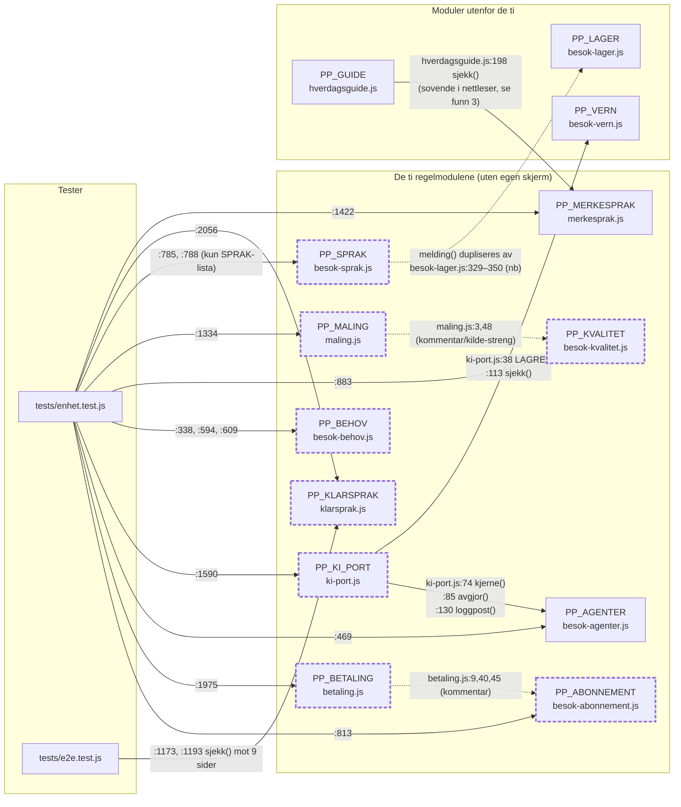

# D – Avhengighetskart: de ti regelmodulene uten egen skjerm

Pathfinder fase 1 · 2026-08-24 · Dette er et **avhengighetskart** (hvem bruker
hvem), ikke en hendelsesflyt.

## Kilder

| Fil | Lest linjeområde |
|---|---|
| `assets/js/besok-abonnement.js` | 1–105 (hele) |
| `assets/js/betaling.js` | 1–232 (hele) |
| `assets/js/besok-agenter.js` | 1–259 (hele) |
| `assets/js/ki-port.js` | 1–163 (hele) |
| `assets/js/besok-behov.js` | 1–176 (hele) |
| `assets/js/besok-kvalitet.js` | 1–161 (hele) |
| `assets/js/maling.js` | 1–177 (hele) |
| `assets/js/besok-sprak.js` | 1–307 (hele) |
| `assets/js/klarsprak.js` | 1–253 (hele) |
| `assets/js/merkesprak.js` | 1–186 (hele) |
| `tests/enhet.test.js` | 1–60 (lastelista), 338–2123 (gruppene som leser modulene), 780–795 |
| `tests/e2e.test.js` | 1150–1210 (klarspråk-porten) |
| `assets/js/hverdagsguide.js` | 185–210 |
| `assets/js/klarhet.js` | 110, 160, 230–245 |
| `assets/js/besok-lager.js` | 320–350 |
| `klarhet.html` | 99, 205–211 (script-lista) |
| Grep: `PP_*` med ordgrense over `assets/js`, `tests/`, `*.html`; script-src-inventar over alle HTML-filer | – |

## Modulene, én for én

Format: formål (fra headerkommentaren) · offentlig API (return-blokken) · hvem
som bruker den.

### 1. PP_ABONNEMENT – `assets/js/besok-abonnement.js`

- **Formål** (l. 1–19): Abonnement og fakturering i B2B-modellen. Leverandøren
  betaler; strømmene `familie` og `mellom` er sperret av juridiske grunner
  (forbrukerrett, betalingsformidling/J11). Kortopplysninger lagres aldri.
- **API** (return l. 100–104): `PLANER`, `STROMMER`, `MVA`, `plan(id)`,
  `status(abo)`, `faktura(abo)`, `formater(kr)`, `dagerIgjen(abo)`.
- **Brukes av:** **Bare tester.** `tests/enhet.test.js:813`
  (`var AB = window.PP_ABONNEMENT`, gruppe «Abonnement og betalingsstrømmer»
  l. 811–880). `betaling.js:9, 40, 45` viser til den, men bare i kommentarer
  og i en `hvorfor`-streng («Se PP_ABONNEMENT.STROMMER.familie») – ingen
  kodeavhengighet.

### 2. PP_BETALING – `assets/js/betaling.js`

- **Formål** (l. 1–19): Kontrakten en betaling skal oppfylle – tilstander,
  lovlige overganger, angrerett, opplysningsplikt. Kaller ingen
  betalingsleverandør (nøkkel hører hjemme på server). Klarhet-strømmen står
  som `avklares`, og `bestill()` nekter til jurist har åpnet den.
- **API** (return l. 217–231): `STROM`, `TILSTAND`, `LOVLIGE_OVERGANGER`,
  `FRIGIS_ETTER_TIMER`, `ANGRERETT`, `FOR_AVTALE`, `LAGRES`, `LAGRES_ALDRI`,
  `LEVERANDORVALG`, `strom(id)`, `tilstand(id)`, `kanGaaTil(fra, til)`,
  `bestill(onske)`.
- **Brukes av:** **Bare tester.** `tests/enhet.test.js:1975`
  (`var BET = window.PP_BETALING`, gruppe «Betaling» l. 1977–2055).

### 3. PP_AGENTER – `assets/js/besok-agenter.js`

- **Formål** (l. 1–26): KI-agentene med grensene innebygd: fire autonominivåer
  (`auto`/`godkjenning`/`menneske`/`aldri`), 14 agenter, uttømmende lister for
  hva som er automatisk, hva som krever menneske, og hva som ikke finnes.
  Obligatorisk beslutningslogg med sju felter.
- **API** (return l. 244–258): `AUTONOMI`, `AVSENDER`, `AGENTER`,
  `AUTOMATISK`, `KREVER_MENNESKE`, `ALDRI`, `NOD`, `LOGGFELT`, `KONTROLL`,
  `agent(id)`, `kjerne()`, `avgjor(handlingId, risiko)`, `loggpost(p)`.
- **Brukes av:** **Modul + tester.**
  - `assets/js/ki-port.js:74` (`PP_AGENTER.kjerne()`), `:85`
    (`PP_AGENTER.avgjor(f.handling, risiko)` – selve porten), `:129–130`
    (`PP_AGENTER.loggpost({...})`). Eneste modul→modul-avhengighet i kode
    blant de ti.
  - `tests/enhet.test.js:469` (`var AG = window.PP_AGENTER`, gruppe
    «KI-agenter» l. 467–522).

### 4. PP_KI_PORT – `assets/js/ki-port.js`

- **Formål** (l. 1–20): Porten mellom en språkmodell og systemet. Risikonivået
  regnes av systemet, ikke av modellen – modellen foreslår, systemet avgjør.
  Kaller ingen modell; her ligger kontrakten svaret må oppfylle, pluss
  `OPPSETT` for et framtidig backend-kall.
- **API** (return l. 155–162): `FORSLAGSFELT`, `SIKKERHETSGRENSE`, `OPPSETT`,
  `mangler(forslag)`, `vurder(forslag, risiko, kontekst)`,
  `loggfor(forslag, dom, endretAv)`.
- **Avhenger selv av:** `PP_AGENTER` (l. 74, 85, 129–130, se over) og
  `PP_VERN` utenfor de ti (l. 37–38 `PP_VERN.LAGRES`, l. 112–113
  `PP_VERN.sjekk` – begge bak `window.PP_VERN`-vakt).
- **Brukes av:** **Bare tester.** `tests/enhet.test.js:1590`
  (`var KP = window.PP_KI_PORT`, gruppe «KI-porten» l. 1588–1705).

### 5. PP_BEHOV – `assets/js/besok-behov.js`

- **Formål** (l. 1–13): Behovsplattformen: grupperer forespørsler som ikke
  passet tilbudet og foreslår manglende tjenester. Etterspørsel oppretter
  aldri en kategori selv; alt over helsegrensen rapporteres og kan ikke
  godkjennes. Teller uten å huske fritekst eller kundeidentifikator (art. 28
  nr. 10-begrunnelsen står i JSDoc l. 88–105).
- **API** (return l. 169–175): `KANDIDATER`, `HELSEORD`, `klassifiser(tekst)`,
  `analyser(kilder, aktiveOppgaver)`, `formuler(f)`.
- **Brukes av:** **Bare tester.** `tests/enhet.test.js:338` (`var B =
  window.PP_BEHOV`, grupper «Helsegrensen …» og «Behovsanalyse» l. 340–392)
  og direktekall `tests/enhet.test.js:594, 609` (gruppe «Behovsplattformen
  husker ikke» l. 591).

### 6. PP_KVALITET – `assets/js/besok-kvalitet.js`

- **Formål** (l. 1–9): Tilfredshet (ett spørsmål på åtte språk) og
  sammenstilling per medarbeider. Systemet foreslår, leverandøren bedømmer –
  aldri en score som selv avgjør arbeid (J8). Kontinuitetsforslag: samme
  kjente person foran høyest rangerte fremmede.
- **API** (return l. 159–160): `sporsmal(kode, firma)`,
  `perMedarbeider(besokListe)`, `forslag(statistikk)`,
  `foreslaaMedarbeider(kunde, besokListe, tilgjengelige)`, `VERDI`.
- **Brukes av:** **Bare tester.** `tests/enhet.test.js:883` (`var KV =
  window.PP_KVALITET`, gruppe «Kvalitet og kontinuitet» l. 881–940).
  `maling.js:3` (header) og `maling.js:48` (kilde-streng «PP_KVALITET: bra =
  2 …») samt `klarhet.js:110` viser til den kun i kommentar/streng.

### 7. PP_MALING – `assets/js/maling.js`

- **Formål** (l. 1–13): De åtte styringstallene med mål, kilde og begrunnelse
  skrevet ned på forhånd, pluss stopp-punktene for piloten. Enkeltsvar
  aggregeres og slettes med besøket (J8).
- **API** (return l. 167–176): `MAL`, `STOPPUNKT`, `PILOT`, `mal(id)`,
  `status(m, verdi)`, `beregn(tellere)`, `oversikt(tellere)`,
  `pilotdom(tellere)`.
- **Brukes av:** **Bare tester.** `tests/enhet.test.js:1334` (`var ML =
  window.PP_MALING`, gruppe «Målingene» l. 1332–1419). `klarhet.js:160`
  nevner den i en kommentar.

### 8. PP_SPRAK – `assets/js/besok-sprak.js`

- **Formål** (l. 1–10): Familiemeldingen på 18 språk. Bare faste deler
  oversettes; medarbeiderens frie kommentar vises som skrevet med etikett på
  mottakerens språk.
- **API** (return l. 306): `SPRAK`, `melding(besok, kode, firma, kontakt)`,
  `oppgavenavn(id, kode)`.
- **Brukes av:** **Bare tester – og bare `SPRAK`-lista.**
  `tests/enhet.test.js:785, 788` (klage-testen «medarbeidervarselet finnes på
  alle språkene vi tilbyr» sammenlikner `PP_KLAGE.MEDARBEIDERVARSEL` mot
  `PP_SPRAK.SPRAK`). `melding()` og `oppgavenavn()` kalles **ingen steder** –
  verken i moduler, skjermer eller tester.

### 9. PP_KLARSPRAK – `assets/js/klarsprak.js`

- **Formål** (l. 1–21): Klart språk som sperre: LIX per teksttype
  (beslutning/informasjon/juridisk), setningslengde, kanselli-ord, passiv og
  substantivsykdom. Passiv er en unnvikelse i en tjeneste der spørsmålet er
  hvem som bestemmer.
- **API** (return l. 241–252): `TYPE`, `STANDARDTYPE`, `ORD_MAKS`, `ORD`,
  `lix(tekst)`, `nivaa(verdi)`, `setninger(tekst)`, `ord(tekst)`,
  `sjekk(tekst, type)`, `maal(tekst)`.
- **Brukes av:** **Bare tester – men der som aktiv kvalitetsport.**
  - `tests/enhet.test.js:2056` (`var KS = window.PP_KLARSPRAK`, gruppe «Klart
    språk» l. 2058–2123).
  - `tests/e2e.test.js:1173, 1190` (`addScriptTag({path:
    'assets/js/klarsprak.js'})`) og `:1193`
    (`window.PP_KLARSPRAK.sjekk(hoved.innerText, type)`) – kjører
    `sjekk()` mot ni faktiske sider og feiler bygget ved brudd.

### 10. PP_MERKESPRAK – `assets/js/merkesprak.js`

- **Formål** (l. 1–17): Merkeplattformen som kjørbar sjekk: påstander vi kan
  stå for og syv `ALDRI`-mønstre («er trygg», overvåking, «erstatter
  familien» …). Sondringen: «trygg hjelp» om tjenesten er lov, «Kari er
  trygg» om et menneske er det ikke.
- **API** (return l. 174–185): `POSISJON`, `KJERNE`, `SELGER`, `BEVIS`,
  `ALDRI`, `HELLER`, `UTEN_TRYGG`, `sjekk(tekst, kontekst)`,
  `kjerneErHel(flate)`, `selger(malgruppe)`.
- **Brukes av:** **Modul + tester.**
  - `assets/js/hverdagsguide.js:197–198`
    (`window.PP_MERKESPRAK.sjekk(tekst, 'artikkel')` i `sjekkUtkast`, bak
    vakt). Se funn 3 under om at kanten er sovende i nettleseren.
  - `tests/enhet.test.js:1422` (`var MS = window.PP_MERKESPRAK`, gruppe
    «Merkespråket» l. 1420–1523).
  - `klarhet.html:99` viser til `PP_MERKESPRAK.BEVIS` i en HTML-kommentar.

## Avhengighetskart

Heltrukne kanter er faktiske kall (fil:linje). Stiplede kanter er
kommentar-/streng-referanser uten kode. Moduler med tykk stiplet ramme leses
**kun av testene**.

**Kun testene leser:** PP_ABONNEMENT, PP_BETALING, PP_KI_PORT, PP_BEHOV,
PP_KVALITET, PP_MALING, PP_SPRAK, PP_KLARSPRAK (åtte av ti).
**Brukes av andre moduler:** PP_AGENTER (av ki-port.js) og PP_MERKESPRAK (av
hverdagsguide.js – men bare i testmiljøet, se funn 3).

## Konkrete funn

1. **Ingen av de ti lastes på noen HTML-side.** Script-src-inventaret over
   alle HTML-filer i repoet inneholder ingen av de ti filnavnene. De lever
   utelukkende via `require()` i `tests/enhet.test.js:18–42` og via
   `addScriptTag` i `tests/e2e.test.js:1173, 1190` (kun klarsprak.js). De er
   kontrakter/regelverk-som-kode holdt fast av testene, ikke kjørende
   produktkode.
2. **Én eneste kodeavhengighet modul→modul blant de ti:**
   `ki-port.js → besok-agenter.js` (l. 74, 85, 130). Alle andre «bruker»-spor
   i modulkode er kommentarer eller strenger.
3. **PP_MERKESPRAK-kanten er sovende i nettleseren.** Eneste side som laster
   hverdagsguide.js er `klarhet.html:207`, og dens script-liste
   (l. 205–211) inneholder **ikke** merkesprak.js. Vakten
   `if (window.PP_MERKESPRAK)` i `hverdagsguide.js:197` gjør at
   merkespråk-sjekken i `sjekkUtkast()` stille faller bort i produktet og
   bare faktisk kjører i enhetstestene (som laster begge).
4. **PP_SPRAK.melding() kalles aldri, og logikken er duplisert.**
   `besok-lager.js:329–350` (`familiemelding`) bygger den norske
   familiemeldingen med egne strenger som svarer til nb-malene i
   `besok-sprak.js:41–51` – 18-språksmodulen står ubrukt ved siden av.
   Testene leser bare `SPRAK`-lista (enhet.test.js:785, 788). Kandidat for
   fase 2 (samling av duplisert bekymring).
5. **PP_KLARSPRAK er den eneste av de ti med en håndhevende rolle i dag:**
   e2e-testen kjører `sjekk()` mot ni faktiske sider med teksttype per side
   (`tests/e2e.test.js:1175–1204`) og feiler ved brudd.
6. **Verdikontrakt uten kodekontrakt:** `maling.js:48` siterer PP_KVALITETs
   skala (bra=2/greit=1/ikke=0, `VERDI` i besok-kvalitet.js:41) i en streng.
   Endres skalaen, må to filer endres i takt uten at noe binder dem.
   Tilsvarende gjelder sperre-begrunnelsene betaling↔abonnement (funn i
   betaling.js:43–45).
7. **PP_KI_PORT er robust mot fravær av avhengighetene sine:** mangler
   `PP_AGENTER` gir `kjerne()`-fallbacken tom liste og forslaget avvises som
   `ukjent_agent` (ki-port.js:74–79) før det ugardede kallet på l. 85 nås;
   `PP_VERN`-kallene står bak vakter (l. 37, 112).

## Tillitsnotat

**Høy tillit** til kart og kallsteder: alle ti modulfiler er lest i sin
helhet, brukersøket er gjort med ordgrense (`PP_SPRAK\b` osv. – nødvendig,
siden `PP_SPRAK` ellers matcher `PP_SPRAK_UI` og `PP_SPRAKKRAV`), og
script-inventaret over HTML dekker alle sider i repoet. Ingen dynamisk
oppslag (`window["PP_" + …]`) finnes i assets/js eller tests/, så statisk
grep fanger alle kallsteder.

**Hull:**

- Testene er ikke kjørt i denne økten; linjenumre og kallsteder er verifisert
  ved lesing, ikke ved kjøring. Testgruppenes sluttlinjer er anslått fra
  neste gruppes start.
- `docs/` er ikke gjennomgått; referansene J5/J8/J11/J16 og
  SERVICE-BLUEPRINT er tatt på modulenes ord.
- «Bare tester»-merkingen gjelder repoet slik det står i dag; en framtidig
  backend (jf. `PP_KI_PORT.OPPSETT.kallesFra: 'server'` og
  `PP_BETALING`-kontrakten) er de tiltenkte konsumentene for flere av dem.
- Kommentar-referanser er telt som ikke-avhengigheter; om noen av dem er
  ment som framtidige kodekanter, framgår det ikke av koden.
