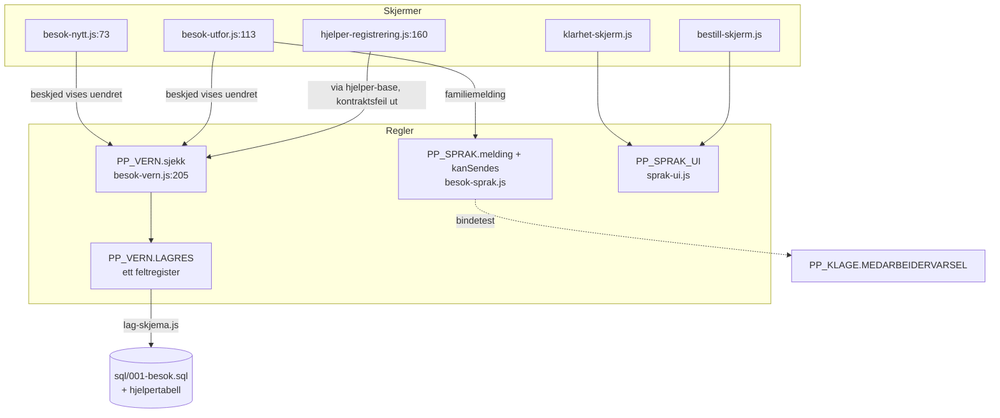

# Samlet forslag – Pathfinder fase 3

Skrevet av orkestratoren på grunnlag av 02a/02b. Prinsippet gjennom hele:
**sletting foran abstraksjon, én sti foran konfigurerbare stier.** I en
byggefri IIFE-kodebase koster hvert nytt lag mer enn det sparer, så
forslagene under samler bare der divergensen er målbart tilfeldig og
allerede har produsert feil.

## Det som IKKE skal samles (dømt legitimt)

| Bekymring | Hvorfor adskillelsen er villet |
|---|---|
| Hele C-området mot A/B | Parkert markedsplassmodell bak juridisk grense (JURIDISK-GRENSE beslutning 1). Å flette C inn i produktet ville gjeninnføre modellen kode for kode |
| `les()/rydd()/skriv()` ×2 (A6) | Sletteemantikken er policy og skal stå eksplisitt der den gjelder – en delt lagerabstraksjon ville gjemme den |
| Tre prislogikker (02b funn 4) | Fast pris i B er en produktbeslutning begrunnet i koden; PP_PRIS er C-modellens timepris |
| Fem tekst-sperremotorer (D1) | Kontrakter med hver sin semantikk; bindes med tester, ikke kode |
| Stegnavigasjon `visSteg`/`visPanel` (C2) | Parkert kode; ulike interaksjonsmodeller |

## System 1 – Meldinger til familien: én modul, ikke fem tabeller

**Konsolidert komponent:** `PP_SPRAK` (`assets/js/besok-sprak.js`) – finnes,
er død i dag, og er den eneste med riktig oppgavekilde.

**Ett inngangspunkt:** `PP_SPRAK.melding(besok, sprakkode)`.

Hva hvert kallsted blir:

| I dag | Blir |
|---|---|
| `besok-lager.js:330–358 familiemelding()` (norsk-bare kopi med to kjente feil: «via Naviar» og *planlagte* oppgaver) | Slettes; `PP_BESOK` re-eksporterer `PP_SPRAK.melding` eller skjermene kaller PP_SPRAK direkte |
| `besok-utfor.js:150`, `besok-historikk.js:66` | Kaller `PP_SPRAK.melding()`; `besok/*.html` laster `besok-sprak.js` |
| `sprak-ui.js kanApnes()/GODKJENT` (:336, :363–381) | Mønsteret kopieres inn i PP_SPRAK som `kanSendes()` – modulen som skal sende uovervåkede oversettelser er den som trenger porten mest |
| `PP_KLAGE.MEDARBEIDERVARSEL`, `PP_KVALITET.SPORSMAL` | Beholdes som kontrakter; bindetesten i `enhet.test.js:785–788` utvides til å holde språklistene i takt |
| `klarhet-skjerm.js` språkvelger/akutt/opplesning ×3 (02a B1–B3, ~148 linjer) | Én hjelper i `PP_SPRAK_UI` (lastes allerede av alle tre sidene) |

**PP_SPRAK_UI består** – UI-kromstrenger med et bevisst annet språkutvalg er
en annen bekymring enn familiemeldinger. Samlingen er mekanismen (fallback +
godkjenningsport), ikke tabellene.

**Tapt evne:** ingen. To atferdsendringer er rettelser: signaturen blir «via
Naviar Care», og meldingen lister utførte oppgaver i stedet for planlagte
(dagens `familiemelding` kan hevde at noe «ble gjort» som ble hoppet over).

## System 2 – PP_VERN-kappen: én returkontrakt, én visningsregel

**Porten er allerede samlet** (`PP_VERN.sjekk`, `besok-vern.js:205–233`).
Det som samles er bruken – sju varianter blir én regel: *vis
`resultat.beskjed`; finn aldri på egen tekst; les aldri felt kontrakten
ikke har.*

| Kallsted | Endring |
|---|---|
| `hjelper-registrering.js:160–167` | Slett den hardkodede tredje-teksten; vis `beskjed` fra vernet (alternativ-prinsippet: «ring 113 først» skal fram) |
| `hjelper-base.js:105–113` | Kast `{ beskjed, kategorier }` fra kontrakten i stedet for egen generisk `grunn` |
| `ekspertbistand.js:728–733` | Slett `f.hva`/`f.istedenfor`-lesningene – feltene har aldri eksistert; bruk `funn[].navn/beskjed` |
| `klarhet.js:374–381` | Behold egen `istedenfor`-tekst bare hvis den er en villet produkttekst; ellers `beskjed` |
| Fail-open-vaktene (`besok-nytt.js:73` m.fl.) | Policyen dokumenteres i `besok-vern.js`-hodet og låses med én enhetstest; C-områdets fravær av PP_VERN merkes i fila, ettermonteres ikke (parkert) |

**Tapt evne:** ingen; den stille kontraktsdriften i B (fallbacker som alltid
fyrer) blir umulig.

## System 3 – Ett feltregister

`PP_VERN.LAGRES` er i dag sannheten for besøksfeltene (testen krever
grunnlag + frist per felt, og `lag-skjema.js` genererer SQL fra den).
Hjelperbasen (`hjelper-base.js`) holder sitt eget feltsett uten samme
binding – SQL-generatoren dekker den ikke.

**Forslag:** hjelperfeltene inn i `PP_VERN.LAGRES` (med grunnlag og frist),
`lag-skjema.js` utvides til å generere hjelpertabellen fra samme register,
og `hjelper-base` leser slettefrister derfra. Én kilde, som i dag – bare
komplett.

## Småfiks-bunt (fra 02a-kortlista og fase 1-funnene)

`arbeiderlenke()` ×2 → `PP_BESOK`; én e-postregex (4 steder); `esc()`
likhets-test + i A flyttes til `PP_BESOK`; PP_RUTER-idiom 1 overalt; én
DEMO-ekspertliste; samtykkebanneret mangler på familie.html m.fl.;
`finnSoknadIndeks` −1-vakt i drift.js; `klarhet.html` laster ikke
`merkesprak.js` (sovende kontroll: last den, eller slett kanten).

## Samlet målbilde

Rekkefølge: System 2 først (feil synlige for brukere i dag), så 1, så
småfiksene, så 3 (krever SQL-regenerering og full testkjøring).
