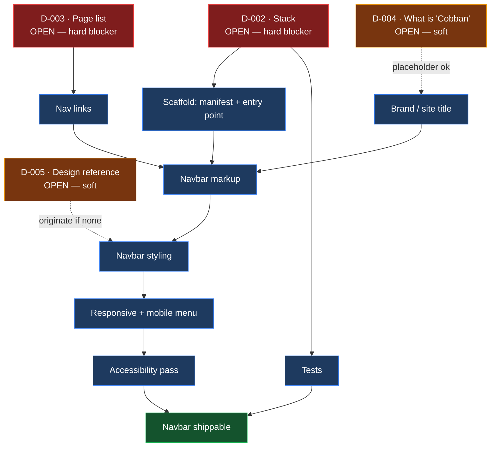

# BETA-ART — Project Status

**Component:** Navbar (BETA ART / Cobban)
**Branch:** `claude/navbar-beta-art-cobban-6t07ru`
**Overall:** Not started — blocked
**Last updated:** 2026-08-20

---

## Summary

The repository is a bare scaffold. No application code, build configuration,
or navbar implementation exists yet. This file records the actual state of
the repo so the navbar work has a documented starting point.

## Repository contents

| File | State |
| ---- | ----- |
| `CLAUDE.md` | Project memory — durable facts, conventions, doc map |
| `README.md` | Project overview, status pointers, layout |
| `STATUS.md` | This file |
| `PROGRESS.md` | Dated work log |
| `DECISIONS.md` | Decision log — D-001 accepted, D-002…D-005 open |
| `SECURITY.md` | Unmodified GitHub template — placeholder text, needs a real contact and version table |

No source directories (`src/`, `app/`, `components/`), no package manifest,
no CI workflows, no tests.

## Navbar status

| Item | Status | Notes |
| ---- | ------ | ----- |
| Navbar markup | Not started | No HTML/JSX component in the repo |
| Navbar styling | Not started | No CSS/Tailwind/theme files present |
| Responsive / mobile menu | Not started | — |
| Accessibility (keyboard nav, ARIA, focus states) | Not started | — |
| Routing / link targets | Not started | Site page list undefined |
| Tests | Not started | No test runner configured |

**Progress: 0%.**

## Blockers

| Blocker | Decision | Effect |
| ------- | -------- | ------ |
| No stack chosen | [D-002](DECISIONS.md) | Cannot write a component — unknown whether HTML, React, or Next.js |
| No page list | [D-003](DECISIONS.md) | Cannot write nav links — targets undefined |
| "Cobban" undefined | [D-004](DECISIONS.md) | Cannot set the site title / brand text in the navbar |
| No design reference | [D-005](DECISIONS.md) | Styling would be invented rather than matched |

D-002 and D-003 are hard blockers; D-004 and D-005 can be worked around with
placeholders if needed.

## Dependency graph

How the open decisions gate the navbar work. Everything downstream of D-002
and D-003 is unreachable until those two are answered.

**Critical path:** D-002 → scaffold → markup → styling → responsive →
accessibility. D-003 joins at markup. Nothing on this graph has been started.

## Open questions

1. What stack should BETA-ART use (static HTML/CSS, React, Next.js, other)?
2. What are the navbar links — what pages will the site have?
3. What does "Cobban" refer to — a brand name, a theme variant, or a
   person/owner? It appears only in the branch name, nowhere in the code.
4. Is there an existing design (Figma, mockup, reference site) to match?

## Next steps

- [ ] Answer D-002 (stack) and D-003 (page list) — unblocks everything below
- [ ] Add a package manifest / entry point for the chosen stack
- [ ] Build the navbar component
- [ ] Add responsive behaviour and a mobile menu
- [ ] Pass an accessibility check (tab order, ARIA, visible focus)
- [ ] Replace the placeholder text in `SECURITY.md`
