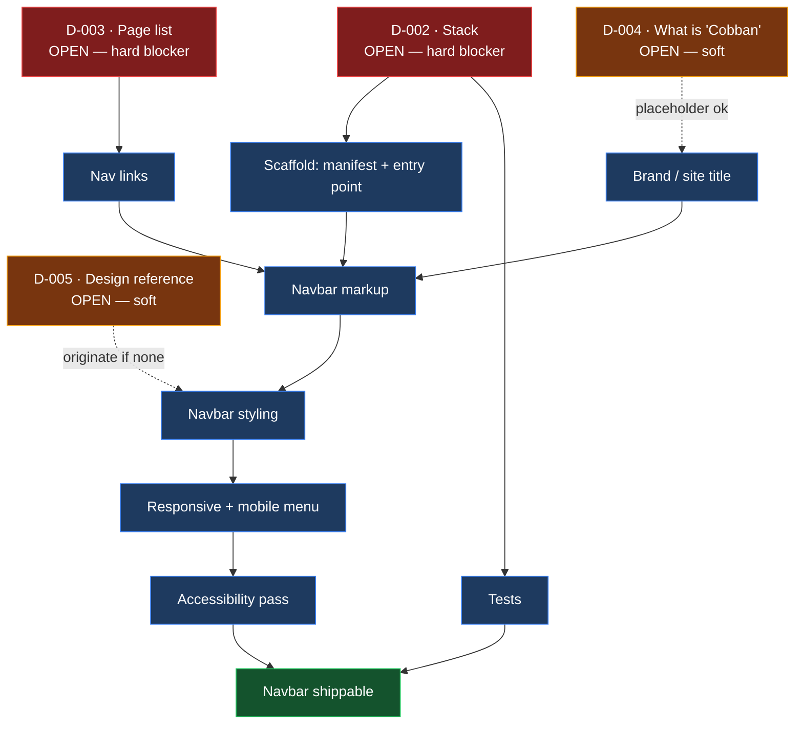

# BETA-ART — Project Status

**Component:** Navbar (BETA ART / Cobban)
**Branch:** `claude/navbar-beta-art-cobban-6t07ru`
**Overall:** Built, audited twice (HIG + Vercel guidelines), all findings fixed
**Last updated:** 2026-08-21

---

## Summary

The repository is a bare scaffold. No application code, build configuration,
or navbar implementation exists yet. This file records the actual state of
the repo so the navbar work has a documented starting point.

## Repository contents

| File | State |
| ---- | ----- |
| `CLAUDE.md` | Project memory — durable facts, conventions, doc map |
| `README.md` | Project overview, status pointers, layout |
| `STATUS.md` | This file |
| `PROGRESS.md` | Dated work log |
| `DECISIONS.md` | Decision log — D-001 accepted, D-002…D-005 open |
| `SECURITY.md` | Unmodified GitHub template — placeholder text, needs a real contact and version table |

No source directories (`src/`, `app/`, `components/`), no package manifest,
no CI workflows, no tests.

## Navbar status

| Item | Status | Notes |
| ---- | ------ | ----- |
| Navbar markup | Built | `src/index.html` |
| Navbar styling | Built | `src/styles.css` |
| Responsive / mobile menu | Working | `src/nav.js`; verified opening and closing at 390px |
| Accessibility | Passes | All contrast ≥ AA, 44×44 targets, reduced-motion honoured, focus rings, ARIA state |
| Routing / link targets | Built | Home, Work, About, Contact |
| Tests | Passing | 11 behavioural tests, `npm test` |

**Progress: complete for this scope.** All audit findings fixed and
re-verified — see the Resolution table in [AUDIT.md](AUDIT.md).

## Blockers

| Blocker | Decision | Effect |
| ------- | -------- | ------ |
| "Cobban" undefined | [D-004](DECISIONS.md) | Cannot set the site title / brand text in the navbar |
| No design reference | [D-005](DECISIONS.md) | Styling would be invented rather than matched |

D-002 and D-003 are now closed. D-004 and D-005 remain open but did not block
the first pass.

## Dependency graph

How the open decisions gate the navbar work. Everything downstream of D-002
and D-003 is unreachable until those two are answered.



**Critical path:** D-002 → scaffold → markup → styling → responsive →
accessibility. D-003 joins at markup. Nothing on this graph has been started.

## Open questions

1. What stack should BETA-ART use (static HTML/CSS, React, Next.js, other)?
2. What are the navbar links — what pages will the site have?
3. What does "Cobban" refer to — a brand name, a theme variant, or a
   person/owner? It appears only in the branch name, nowhere in the code.
4. Is there an existing design (Figma, mockup, reference site) to match?

## Build and test

```
npm run build   # validate sources, emit dist/
npm test        # 11 behavioural tests (Playwright + node:test)
npm run check   # both
```

There is no bundler by design (D-002) — the build validates and copies. It
fails on unbalanced tags, undeclared CSS custom properties, missing assets,
and JS syntax errors.

## Next steps

- [x] Answer D-002 (stack) and D-003 (page list)
- [x] Build the navbar
- [x] Audit it against HIG principles → [AUDIT.md](AUDIT.md)
- [x] Wire up the mobile menu toggle
- [x] Fix contrast and add `prefers-reduced-motion`
- [x] Raise hit targets to 44×44
- [x] Convert px→rem and set an explicit type scale
- [ ] Build the actual pages the navbar links to (Work, About, Contact)
- [ ] Resolve D-004 ("Cobban") and D-005 (design reference)
- [ ] Replace the placeholder text in `SECURITY.md`
