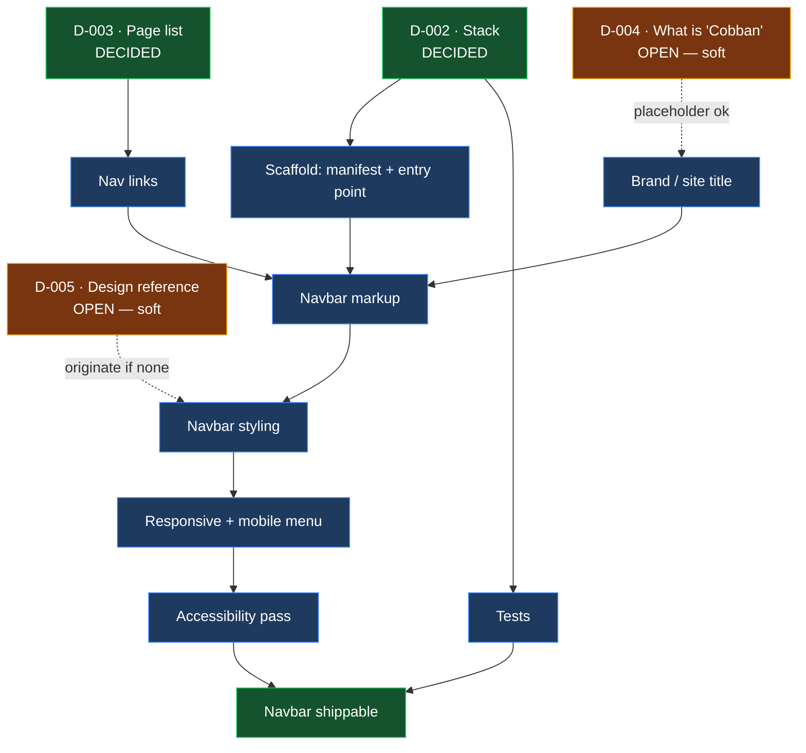

# BETA-ART — Project Status

**Component:** Navbar (BETA ART / Cobban)
**Branch:** `claude/navbar-beta-art-cobban-6t07ru`
**Overall:** Built, audited twice (HIG + Vercel guidelines), all findings fixed
**Last updated:** 2026-08-25

---

## Summary

The navbar is built, styled, responsive, accessible, and covered by 11
behavioural tests. `npm run check` builds and tests it. An authentication
schema exists and is verified against local PostgreSQL, but nothing is
deployed. The last known defect — the skip link not moving focus — was fixed
on 2026-08-25 and is now covered by a test proven to fail without the fix.

## Repository contents

| File | State |
| ---- | ----- |
| `CLAUDE.md` | Project memory — durable facts, conventions, doc map |
| `README.md` | Project overview, status pointers, layout |
| `STATUS.md` | This file |
| `PROGRESS.md` | Dated work log |
| `DECISIONS.md` | Decision log — D-001 accepted, D-002…D-005 open |
| `SECURITY.md` | Unmodified GitHub template — placeholder text, needs a real contact and version table |
| `AUDIT.md` | Findings from both design audits, with a resolution table |
| `STACK.md` | Agent tooling chain — verified vs assumed |
| `BUSINESS.md` | Revenue model options — not a decision |
| `src/` | Six source files: markup, styles, nav, auth, auth-ui, config |
| `scripts/build.mjs` | Validating build — emits `dist/` |
| `tests/navbar.test.mjs` | 11 behavioural tests |
| `supabase/` | Auth schema and RLS test suite |
| `.claude/skills/` | `task-observer`, `evidence-discipline`, `run-beta-art`, `financial-model-build` |

No CI workflows.

## Navbar status

| Item | Status | Notes |
| ---- | ------ | ----- |
| Navbar markup | Built | `src/index.html` |
| Navbar styling | Built | `src/styles.css` |
| Responsive / mobile menu | Working | `src/nav.js`; verified opening and closing at 390px |
| Accessibility | Passes | All contrast ≥ AA, 44×44 targets, reduced-motion honoured, focus rings, ARIA state |
| Routing / link targets | Built | Home, Work, About, Contact |
| Tests | Passing | 11 behavioural tests, `npm test` |
| Skip link | Fixed 2026-08-25 | `tabindex="-1"` on `<main>`; test asserts the focus move and was confirmed to fail without it |

**Progress: complete for this scope.** All audit findings fixed and
re-verified — see the Resolution table in [AUDIT.md](AUDIT.md).

## Blockers

| Blocker | Decision | Effect |
| ------- | -------- | ------ |
| "Cobban" undefined | [D-004](DECISIONS.md) | Cannot set the site title / brand text in the navbar |
| No design reference | [D-005](DECISIONS.md) | Styling would be invented rather than matched |

D-002 and D-003 are now closed. D-004 and D-005 remain open but did not block
the first pass.

## Dependency graph

How the open decisions gate the navbar work. Everything downstream of D-002
and D-003 is unreachable until those two are answered.



**Critical path:** complete. D-002 and D-003 are decided and every work node
above is built and tested. D-004 and D-005 remain open but did not block
delivery — the brand text and the visual design were originated here and are
replaceable once those are answered.

## Open questions

1. What does "Cobban" refer to — a brand name, a theme variant, or a
   person/owner? It appears only in the branch name, nowhere in the code.
   (D-004. Also blocks `BUSINESS.md`.)
2. Is there an existing design (Figma, mockup, reference site) to match?
   (D-005.)
3. The `system-ui` typeface stack was flagged as generic for an art site. A
   distinctive face is a brand decision, not a technical one.
4. `/work`, `/about` and `/contact` all 404 — only `/` is built. The navbar
   links to three pages that do not exist.

Questions 1 and 2 from the previous revision (stack, page list) are answered
by D-002 and D-003 and have been removed.

## Authentication

Schema in `supabase/migrations/0001_auth_and_app_schema.sql`; RLS suite in
`supabase/tests/`. Verified against local PostgreSQL 16.13 — 8/8 policy tests
pass, including two escalation attempts that are correctly denied.

Browser client written: `src/auth.js` (session, sign in/up/out),
`src/config.js` (placeholders), `src/auth-ui.js` (navbar control). Loads
supabase-js from a CDN as an ES module, so there is still no build step.

**Verified:** with no config, the control degrades to a disabled "Sign in"
button titled *Authentication is not configured yet*, and the mobile menu
still opens — auth does not break the page. Build validates all six source
files; both new checks were proven to fail on real defects.

**Not verified:** sign-in, sign-up, sign-out, session persistence. No
Supabase project exists and `supabase.co` is unreachable from this
container, so the happy path has never been executed. Nothing is deployed.

## Build and test

```
npm run build   # validate sources, emit dist/
npm test        # 11 behavioural tests (Playwright + node:test)
npm run check   # both
```

There is no bundler by design (D-002) — the build validates and copies. It
fails on unbalanced tags, undeclared CSS custom properties, missing assets,
and JS syntax errors.

## Next steps

- [x] Answer D-002 (stack) and D-003 (page list)
- [x] Build the navbar
- [x] Audit it against HIG principles → [AUDIT.md](AUDIT.md)
- [x] Wire up the mobile menu toggle
- [x] Fix contrast and add `prefers-reduced-motion`
- [x] Raise hit targets to 44×44
- [x] Convert px→rem and set an explicit type scale
- [ ] Build the actual pages the navbar links to (Work, About, Contact)
- [ ] Resolve D-004 ("Cobban") and D-005 (design reference)
- [ ] Replace the placeholder text in `SECURITY.md`
