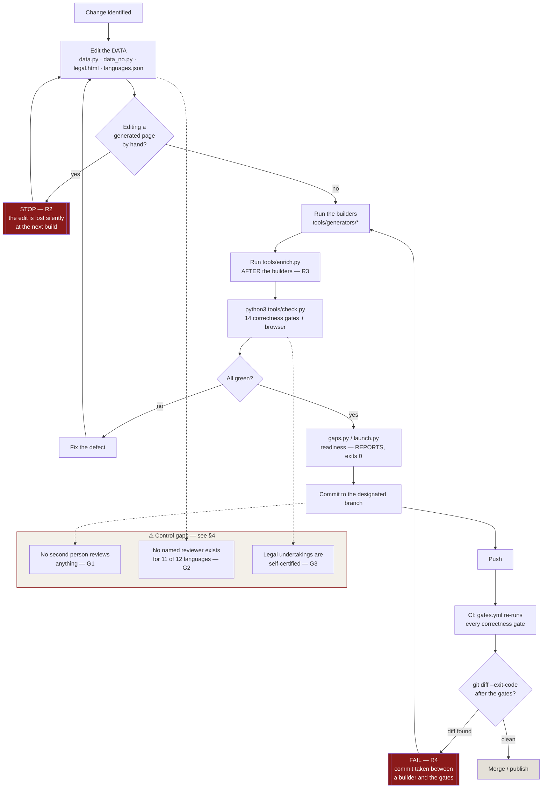

# Process narrative and risk & control matrix — publishing a change to Beta Art

**Prepared:** 2026-08-25

> **What this documents, and what it substitutes for.** The request was "here's
> how this process runs" — but no process description arrived with it, twice. So
> rather than invent someone's month-end close, this narrates **the one process
> this repository actually runs**: how a change gets from an idea to a published
> page. Every control below is a file you can open and a command you can run.
> Every owner, frequency and gap is drawn from the repository, not assumed.
>
> If the intended process was a different one, send the description and this
> format applies to it unchanged — §1–§4 are the standard shape.

---

## 1 · Process narrative

**Process owner:** Betül Öner · **Scope:** all four properties (hub, archive,
business desk, journal) · **Systems:** git, GitHub Actions, the Python
generators in `tools/generators/`, the fourteen gates in `tools/`.

### 1.1 Purpose

Beta Art publishes 102 static pages across four properties. 86 of them are
**generated from data tables**, not written by hand. The purpose of this process
is that a change to a fact — a price, a service name, a legal undertaking, a
language's review status — reaches **every page that states it**, and that no
page is published claiming something the project cannot stand behind.

### 1.2 The narrative

**Step 1 — A change is identified.** A price moves, a policy is decided, copy is
rewritten, a language is reviewed. The change is expressed as a change to
*data*, not to a page.

**Step 2 — The data table is edited.** Facts live in
`tools/generators/data.py` (English) and `data_no.py` (Norwegian, which is
written rather than translated). Legal claims live in `legal.html`. Language
review status lives in `languages.json`. Prices, plates and services live in the
same data layer.

*Control point: the rule "never hand-edit a generated page" is stated in
`CLAUDE.md` and enforced downstream, because a hand edit is silently destroyed
the next time a builder runs.*

**Step 3 — The builders run.** The generators in `tools/generators/` rewrite
every page that mentions the changed fact. `tools/generators/README.md` records
which builder writes which pages.

**Step 4 — Structured data is restored.** `tools/enrich.py` writes breadcrumb
and FAQ structured data back into the pages the builders just overwrote. **This
must run after the builders, not before** — the builders delete what `enrich.py`
puts in. This ordering is the subject of observation 13 in the log.

**Step 5 — The gates run.** `python3 tools/check.py` runs fourteen correctness
gates plus a browser render check at four widths, and exits non-zero on any
failure. The gates are the review step. They are listed in §2.

**Step 6 — Readiness is reported, not gated.** `tools/gaps.py` and
`tools/launch.py` report what is *unfinished* rather than *incorrect*, and exit
zero on purpose — the same reason `git status` exits zero on a dirty tree.
`launch.py` separates machine-answerable items from a PERSON list it says of
itself is *"never marked done here."*

**Step 7 — The change is committed and pushed** to the designated branch.

**Step 8 — CI re-runs everything on a second machine.**
`.github/workflows/gates.yml` runs the correctness set on every push with no
secrets and no third-party actions, then asserts `git diff --exit-code`. That
assertion is the control that **cannot exist locally**: it fails when the gates
had to *repair* the checkout, which is the signature of a commit taken between
running a builder and running the gates.

**Step 9 — Publication.** The site is static; a merged, green branch is the
deliverable.

---

## 2 · Risk and control matrix

**Frequency legend:** *Per change* = every commit · *Per push* = automated on
push · *Periodic* = on a stated cadence · **⚠** = control gap or SoD issue,
detailed in §4.

### 2.1 Content integrity

| # | Risk | Control | Type | Owner | Frequency |
|---|---|---|---|---|---|
| R1 | A fact is corrected on one page and left stale on the twelve others that state it | Facts live once in `data.py`/`data_no.py`; 86 pages are generated from them | Preventive | Betül | Per change |
| R2 | A hand edit to a generated page is silently destroyed by the next build | `CLAUDE.md` prohibition + generated pages are rewritten wholesale, so the loss surfaces as a diff | Preventive / Detective | Betül | Per change |
| R3 | Structured data is destroyed by a builder and shipped missing | `tools/enrich.py` restores it; step ordering is documented | Corrective | Betül | Per change |
| R4 | A commit is taken *between* a builder and the gates, so the repo state on disk differs from the committed state | CI asserts `git diff --exit-code` after running the gates | Detective | GitHub Actions | Per push |
| R5 | A CSS class is used on a page with no rule behind it | `tools/classes.py` | Detective | Automated | Per change / per push |
| R6 | A custom property is defined twice, or does not resolve | `tools/tokens.py` | Detective | Automated | Per change / per push |
| R7 | A later CSS rule silently beats a narrower breakpoint | `tools/cascade.py` | Detective | Automated | Per change / per push |
| R8 | A page scrolls sideways at a width nobody measured | `node tools/render-check.js`, four widths incl. 1024px | Detective | Automated | Per change / per push |

### 2.2 Truthfulness of what is published — the controls that matter most

| # | Risk | Control | Type | Owner | Frequency |
|---|---|---|---|---|---|
| R9 | A page promises something the legal notice only *describes*, so the promise is unbacked | `tools/claims.py` — a claim on a page must be an **undertaking** in the notice | Preventive | Automated | Per change / per push |
| R10 | A form answers a submit with a receipt when the message reaches nobody | `tools/forms.py` — an arrival claim must sit inside the `.then()` of a real request | Detective | Automated | Per change / per push |
| R11 | A machine translation is presented as human-approved | `languages.json` refuses `"status": "reviewed"` without a **named reviewer and a date**; `tools/languages.py` asserts the notice matches the file | Preventive | Betül + named reviewer | Per language |
| R12 | An organisation number, address, archive size or city is invented to fill a blank | Blanks stay blank; `tools/launch.py` PERSON list holds them open | Preventive | Betül | Periodic |
| R13 | Copy overstates what the product does | `tools/copy.py` | Detective | Automated | Per change / per push |
| R14 | Norwegian drifts into kansellistil / substantivsjuke | `tools/klarsprak.py` — feil fail the gate, advisory findings do not | Detective | Automated | Per change / per push |
| R15 | Prices, hosts, i18n keys or harness options drift out of agreement | `tools/qc.py` | Detective | Automated | Per change / per push |
| R16 | Catalogue records misstate the archive | `tools/plates.py` | Detective | Automated | Per change / per push |

### 2.3 Delivery and infrastructure

| # | Risk | Control | Type | Owner | Frequency |
|---|---|---|---|---|---|
| R17 | Sitemap/feeds fall out of step with the pages and articles | `tools/sitemap.py`, `tools/feed.py` | Detective | Automated | Per change / per push |
| R18 | A supply-chain compromise via a third-party Action | `gates.yml` uses only official actions, no secrets, SHA-pinned | Preventive | Betül | Per workflow change |
| R19 | A dependency is added that the site must then carry forever | `CLAUDE.md`: one external dependency (Google Fonts), no bundler, no npm install to view a page | Preventive | Betül | Per change |
| R20 | A mistake recurs silently after being fixed once | `skill-observations/log.md` + `references/promoting-to-a-gate.md` — a new class of mistake becomes a **new gate** | Corrective | Betül | Per session |

---

## 3 · Flowchart



---

## 4 · Control gaps and segregation-of-duties issues

These are the findings. Each is evidenced, and each names what would close it.

### ⚠ G1 — Total absence of segregation of duties. **Severity: high.**

One human being is the author, the reviewer, the approver, the merger and the
process owner. There is no second identity anywhere in the repository's history:

```
 62 commits  Claude <noreply@anthropic.com>        ← the agent
 25 commits  andersenbetul-alt <andersen.betul@gmail.com>
 13 commits  Betül Öner <andersen.betul@gmail.com>
  1 commit   Betul Andersen <andersen.betul@gmail.com>
```

Three of those four identities are **the same person under different git
configurations**. The fourth is an agent operating under her authority. Every
separable duty — prepare, review, approve, publish — resolves to one party.

*What partially mitigates it:* the fourteen gates are a genuine automated
reviewer, and CI re-runs them on a machine that cannot be talked into agreeing.
That is a real compensating control and it is stronger than most one-person
projects have. **It does not cover judgement** — a gate can prove a claim
appears in the notice; it cannot prove the claim is true.

*What would close it:* a second named person with merge rights on any change
touching `legal.html`, `languages.json`, or a price. `docs/22-role-specs.md`
identifies the hire; `docs/23-offer-package.md` §4 records that neither the role
nor the number has been decided.

### ⚠ G2 — The review control exists but has never once been satisfied. **Severity: high.**

`languages.json` implements exactly the right control: `"reviewed"` requires a
named reviewer and a date, because *"a review nobody signed is not a review."*
Current state across the twelve languages:

| Status | Count |
|---|---|
| `source` (English — written, not translated) | 1 |
| `machine` (no native speaker has read it) | 11 |
| `reviewed` (named person, stated date) | **0** |

The control is designed and enforced. **The reviewer resource does not exist.**
A control nobody can perform is a documented gap, not a control — and to the
project's credit the site says so on every page rather than hiding it.

*What would close it:* one named reviewer per language, starting with Norwegian
(`docs/11-korrektur-norsk.md` is the packet, already prepared, queue position 1).

### ⚠ G3 — Legal undertakings are self-certified. **Severity: medium-high, and blocking revenue.**

`claims.py` verifies that a promise on a page is an undertaking in the notice.
It **cannot** verify that the undertaking is lawful. `docs/09-photograph-policy.md`
and `docs/21-research-memo-104-gdpr.md` both record the same unresolved question
— whether § 104 consent and a worldwide perpetual licence can coexist — and both
say a Norwegian lawyer must answer it. Until then the commercial tiers carry an
unquantified risk.

*What would close it:* the lawyer review already scoped at *"a few thousand
kroner"* in `docs/09`.

### ⚠ G4 — The step-ordering control is procedural, not enforced locally. **Severity: medium.**

R3/R4 depend on a human remembering to run `enrich.py` after the builders and
before committing. CI detects the failure **after** the push, not before it.
Observation 13 records the reasoning: the checker *"did not have to be a second
tool. It had to be a second copy."* That is correct and the CI control is real —
but it is detective, one push late, on a public branch.

*What would close it:* a pre-commit hook running `check.py --fast`. Cheap, and
converts a detective control into a preventive one.

### ⚠ G5 — No control over the readiness reports being ignored. **Severity: low.**

`gaps.py` and `launch.py` exit zero by design, so nothing stops shipping with
outstanding items. This is deliberate and correct — but it means the PERSON list
has no escalation path and no review cadence.

*What would close it:* run `launch.py --strict` in the deploy pipeline (the flag
exists), and give the PERSON list a monthly review date.

---

## 5 · Summary for the review

| | Count |
|---|---|
| Documented controls | 20 |
| Automated (run without human action) | 14 |
| Currently passing | 14 of 14 |
| Control gaps | 5 |
| Segregation-of-duties issues | 1, and it is the significant one |

**The one-sentence version:** the automated controls over *correctness* are
unusually strong for a project this size and all fourteen currently pass; the
controls over *judgement* — review, approval, legal sufficiency — are designed
but unstaffed, and all five gaps trace back to the same root cause, which is
that there is exactly one person.
