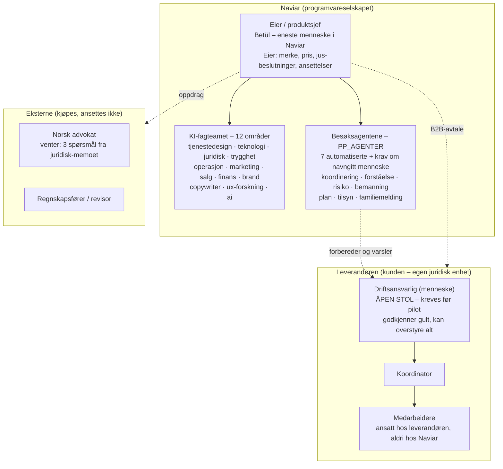

# Organisasjonskart – slik selskapet faktisk ser ut (25.08.2026)

Ikke et ønskediagram. Kartet viser hvem som finnes i dag, hvem som er KI,
hvilke stoler som står tomme med vilje, og hvor grensen mot leverandøren
går. Prinsippet fra agentregisteret gjelder hele kartet: KI foreslår og
utfører det avgrensede, mennesker eier avgjørelsene med følger.

## Kartet

## Rollene, og hvor de er dekket

| Rolle (fra 20-rollersmodellen) | Dekket av | Status |
|---|---|---|
| Produktsjef / strategi | Eieren | Besatt |
| Service-, UX-, brand-, tekst-, teknologi-, jus-, trygghet-, marked-, salg-, finansfag | KI-fagteamet (12 agenter) | Aktivt – rådgivende, aldri besluttende |
| Daglig drift av besøk | Besøksagentene + leverandørens koordinator | Automatikk grønn, menneske gul |
| Driftsansvarlig | **Ingen** | Åpen stol – prosesskontrollens H1; pilot starter ikke uten |
| Stedfortreder for driftsansvarlig | **Ingen** | Samme hull, ferie og natt |
| QA / test | Strukturelt: 344 + 153 tester, regelen «test før du sier virker» | Dekket uten stilling |
| SEO / vekst, dataanalyse | Delvis marketing-agenten | Bevisst utsatt til etter pilot |
| Advokat, regnskap | Eksterne | Kjøpes ved behov |

## Tre regler kartet håndhever

1. **Naviar ansetter ingen hjelpere.** Medarbeiderne er leverandørens –
   det er hele den arbeidsrettslige modellen (aml. § 1-8-presumpsjonen).
2. **Ingen KI-boks rapporterer til en annen KI-boks alene.** Alle piler
   ender hos et menneske: eieren i Naviar, driftsansvarlig hos
   leverandøren.
3. **En tom stol er en beslutning, ikke en glemsel.** Driftsansvarlig står
   åpen fordi den må fylles av leverandøren med navn, telefon og vaktplan
   – ikke av et diagram.
