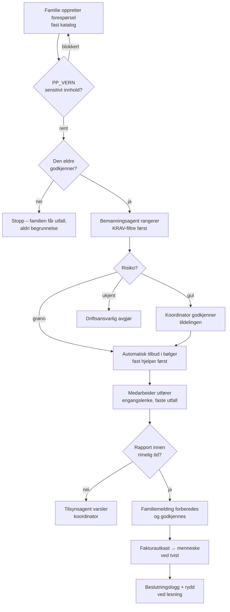

# Besøksprosessen – fortelling, risiko- og kontrollmatrise, flyt

Skrevet 25.08.2026 mot koden slik den står. Formålet er internkontroll:
hvert trinn, risikoen i trinnet, kontrollen som møter den, hvem som eier
kontrollen, og hvor ofte den virker. Hullene står til slutt – de er
funnene, ikke fotnotene.

## 1 · Prosessfortellingen

Familien oppretter en forespørsel fra den faste katalogen
(`PP_BESOK.OPPGAVER` – fire oppgaver, hver med ikke-liste). Fritekst går
gjennom `PP_VERN.sjekk()` før noe lagres; helse- og betalingsopplysninger
blokkeres og lagres ikke. Den eldre godtar eller avviser besøket i egen
godkjenningsskjerm – avvisning gir familien bare utfallet, aldri
begrunnelsen. Bemanningsagenten rangerer leverandørens medarbeidere
(`PP_MATCHING`, filtre før vekter), planleggingsagenten sender tilbud i
bølger med fast hjelper først. Grønn oppgave tildeles automatisk; gul
krever koordinatorens godkjenning (`PP_AGENTER.avgjor()`). Medarbeideren
utfører via engangslenke uten konto, melder start og slutt selv (ingen
posisjonssporing), og rapporterer i faste utfall. Tilsynsagenten lukker
fullførte grønne besøk; familiemeldingen forberedes av agent og godkjennes
før utsending. Hver agentavgjørelse skrives til beslutningsloggen med sju
obligatoriske felter (`loggpost()`), og sletting kjører ved lesning
(`rydd()`), ikke som nattjobb.

## 2 · Risiko- og kontrollmatrise

| # | Trinn | Risiko | Kontroll | Eier | Frekvens |
|---|---|---|---|---|---|
| 1 | Forespørsel | Oppdrag over helsegrensen slipper inn | Fast katalog; PP_BEHOV oppretter aldri kategori av etterspørsel; helseord stoppes | Systemet (fravær av kode) | Hver forespørsel |
| 2 | Forespørsel | Sensitive opplysninger lagres | `PP_VERN.sjekk()` før lagring; blokkert innhold lagres ikke | Personvernagent | Hver skriving |
| 3 | Godkjenning | Besøk gjennomføres mot den eldres vilje | Eldres eksplisitte ja/nei; nei stopper besøket | Den eldre | Hvert besøk |
| 4 | Tildeling | Ukvalifisert eller sperret medarbeider tildeles | KRAV-filtre (rød kategori, kvalifisert, tillitsnivå, egenskaper) før all skåring | Bemanningsagent | Hver rangering |
| 5 | Tildeling | Automatikk tar avgjørelse med store følger | `avgjor()`: gul → godkjenning, ukjent risiko → menneske; ALDRI-lista finnes ikke som kode | Driftsansvarlig | Hver tildeling |
| 6 | Tildeling | Diskriminerende utslag i rangeringen | IKKE_KRITERIUM (alder, kjønn, opprinnelse …); jevnlig gjennomgang av utslag | Driftsansvarlig | «Fast» – se hull H2 |
| 7 | Utførelse | Besøk rapporteres uten å ha skjedd | Engangslenke per besøk; `fullfor()` avviser brukt token; avviksagenten fanger umulige tidspunkter | Tilsyns-/avviksagent | Hvert besøk |
| 8 | Rapport | Helseinnhold i rapporten | Faste utfall; fritekst gjennom samme vern som trinn 2 | Personvernagent | Hver rapport |
| 9 | Familiemelding | Melding til feil mottaker eller med helsevurdering | Agent forbereder, godkjenning før sending; «aldri ‘er trygg’»-regelen | Familiemeldingsagent + koordinator | Hver melding |
| 10 | Betaling | Faktura uten utført besøk, eller tvist avgjort av maskin | Fakturautkast av agent; tvist, prisendring og stor refusjon til menneske | Faktureringsagent + driftsansvarlig | Hver faktura |
| 11 | Hele løpet | Avgjørelse kan ikke etterprøves | Beslutningslogg med sju obligatoriske felter; kast ved manglende felt | Alle agenter | Hver avgjørelse |
| 12 | Hele løpet | Data lever lenger enn grunnlaget | `rydd()` ved hver lesning; slettefrister i PP_VERN.LAGRES, testet felt for felt | Systemet | Hver lesning |

Arbeidsdelingen som holder matrisen sammen: familien bestiller, den eldre
samtykker, agenten foreslår, koordinatoren godkjenner det gule, og
driftsansvarlig kan overstyre alt. Ingen rolle både oppretter, godkjenner
og lukker samme besøk.

## 3 · Flyt

## 4 · Hull og funn – det som mangler kontroll

- **H1 · Stedfortreder for driftsansvarlig.** Kontrollmodellen hviler på én
  navngitt person med telefon og vaktplan. Ferie, sykdom og natt er ikke
  beskrevet: hvem godkjenner gult når driftsansvarlig er borte? Trinn 5,
  6 og 10 står da uten eier. Krever en stedfortrederregel hos leverandøren.
- **H2 · «Fast» er ikke en frekvens.** Gjennomgangen av rangeringsutslag
  (trinn 6) og KONTROLL-punktet «avvik gjennomgås fast» mangler definert
  intervall og dokumentasjonskrav. En kontroll uten frekvens kan ikke
  revideres. Forslag: månedlig, med loggført konklusjon.
- **H3 · Godkjenning med den eldres telefon i andres hender.** Trinn 3
  antar at den som trykker, er den eldre. En pårørende med telefonen i
  hånden kan godkjenne «på vegne av». Kjent begrensning; bør stå i
  vilkårene og i opplæringen, og telefonalternativet (koordinator ringer)
  er den reelle kontrollen for de mest sårbare.
- **H4 · Journalplikt mot vernefilter.** Der leverandøren opererer under
  kommunalt vedtak, kan dokumentasjonsplikten kollidere med at vi
  blokkerer helseinnhold (JURIDISK-MEMO-KONSEPTER, åpent spørsmål 3).
  Kontrollen finnes – spørsmålet er om den er lovlig i den konteksten.
  Ligger hos advokat.
- **H5 · Avstemming besøk ↔ utbetaling.** Fakturautkast kontrolleres, men
  ingen beskrevet kontroll avstemmer summen av fullførte besøk mot summen
  av utbetalinger per periode. Én linje i driftspanelet (antall fullført ×
  sats − utbetalt = 0) ville lukket det.

Ingen av hullene er en ny funksjon som skal bygges i kode nå; H1, H2 og H5
er leverandørens driftsrutiner, H3 er vilkår og opplæring, H4 er juridisk
avklaring. Det er derfor de står her og ikke i en backlog.
