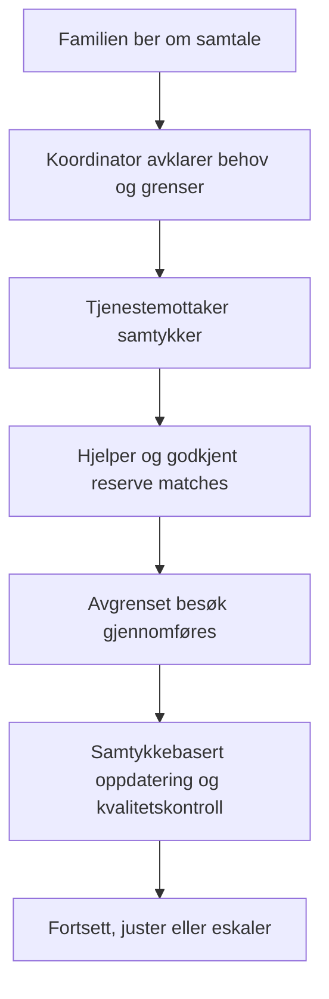

# NAVIAR Care – tjenestevurdering

Vurderingsdato: 26. august 2026
Rolle: Tjenesteutvikler (kullanıcının kendi beyanı — brukerreiser, tjeneste-
blueprint, trygg drift, kvalitet, medarbeideropplevelse ve gerçek ihtiyaca
dayalı iyileştirme)
Grunnlag: NAVIAR Care-konseptet, pilotplanen og offentlig tilgjengelige
rammevilkår. Dette er en tjenestevurdering; det er ikke en juridisk
godkjenning eller en brukertest av den eksisterende nettsiden.

*Bu dosya kullanıcının kendi (veya kullandığı aracın) ürettiği metnin
birebir kaydıdır — Norveççe orijinaliyle korunmuştur. Türkçe çapraz
referanslar için bkz. `docs/naviar/NAVIAR-CARE-IS-MODELI-KRITIK-ANALIZ.md`
ve bu dizindeki `decisions/decision-log.md`.*

## Konklusjon

NAVIAR Care bør gå videre som en smal, bemannet pilot – men er ikke klar
for bred lansering eller plattforminvestering.

Konseptet løser et reelt problem: pårørende trenger trygg og forutsigbar
støtte når de ikke selv kan være til stede. Den beste delen av modellen er
at den behandler den eldre personen, pårørende og hjelperen som tre like
viktige brukere.

Den største risikoen er ikke nettstedet. Det er kombinasjonen av løfte om
trygghet, ansatte i private hjem, personvern, kostnad ved koordinering og
en målgruppe som allerede har kommunale, kommersielle og frivillige
alternativer. NAVIAR lykkes bare dersom den beviser at familier vil betale
for en avgrenset, kontinuerlig og menneskelig koordinert tjeneste – ikke
bare si at de liker ideen.

## Samlet helsevurdering

| Område | Status | Score | Begrunnelse |
|---|---|---|---|
| Reelt behov | Sterkt | 8/10 | Avstand, tidsmangel og usikkerhet hos pårørende er et tydelig problem. |
| Verdiforslag | Lovende | 7/10 | Kombinasjonen av samtykke, fast kontakt og koordinering er forståelig. |
| Differensiering | Ubevist | 5/10 | Fast hjelper og oppdatering til familie finnes delvis hos andre aktører. NAVIAR må bevise at helheten oppleves bedre. |
| Tjenestedesign | God retning | 6/10 | Smalere tjenester og tydelige grenser er riktig, men må testes i reelle besøk. |
| Trygghet og kvalitet | Ikke lanseringsklar | 4/10 | Krever opplæring, hendelsesrutiner, vikarlogikk, forsikring og faktisk driftserfaring. |
| Økonomi | Høy risiko | 4/10 | Reisetid, lønn, avlysninger og koordinering kan spise marginen raskt. |
| Personvern og samtykke | Høy risiko, håndterbar | 4/10 | Betalende pårørende og tjenestemottaker kan ha ulike interesser og rettigheter. |
| Digital løsning | Tilstrekkelig for pilot | 6/10 | Enkel henvendelse og manuell koordinering er bedre enn å bygge en stor app for tidlig. |
| Skalerbarhet | Senere fase | 5/10 | Kan skaleres først når én lokal driftsmodell leverer stabil kvalitet og margin. |

**Total vurdering: 5,4/10 nå. Mulig etter en vellykket pilot: 7/10.**

> **NAVIAR yorumu (çapraz kontrol):** "Differensiering: Ubevist, 5/10" —
> bu, `NAVIAR-CARE-IS-MODELI-KRITIK-ANALIZ.md` §4'te bulunan doğrudan
> rakiplerle (SeniorSupport, VilMer) tam örtüşüyor. İki bağımsız
> değerlendirme aynı zayıflığa işaret ediyor — bu, tesadüf değil gerçek
> bir risk olduğunun güçlü bir işareti.

## Hva NAVIAR faktisk bør være

En pårørendestøttet, ikke-medisinsk hverdagsstjeneste som organiserer
regelmessige sosiale besøk, aktivitet/følge og digital hverdagsstøtte for
personer som selv bor hjemme.

NAVIAR bør ikke markedsføres som hjemmesykepleie, fullverdig hjemmehjelp,
demensomsorg eller en akutt støtteordning. Oslo kommune tilbyr allerede
praktisk bistand/hjemmehjelp for personer med vedtak og behov; NAVIAR må
være et privat supplement med en annen, tydelig rolle.

## Tjenestereisen som må fungere

| Steg | Brukerbehov | Kritisk risiko | Nødvendig tjenestegrep |
|---|---|---|---|
| 1. Henvendelse | Familien vil vite om dette passer | De tror NAVIAR tilbyr helsehjelp eller hjemmehjelp | Klare tjenester og synlige unntak før skjemaet |
| 2. Avklaring | Koordinatoren må forstå behovet uten å samle unødige helseopplysninger | Feil kunde tas inn | Standardisert samtale med stopp- og henvisningskriterier |
| 3. Samtykke | Personen som får besøk må eie egen tjeneste | Betaleren overstyrer personen | Eget samtykke til tjeneste, reservehjelper og familieoppdatering |
| 4. Matching | Ønske om trygghet og kontinuitet | Urealistisk løfte om fast person | Én foretrukket hjelper + én avtalt reserve, uten garanti |
| 5. Besøk | Varm, respektfull og trygg støtte | Oppgaveglidning til medisin, penger eller personlig stell | Rollekort, opplæring og «stopp og eskaler»-regel |
| 6. Oppfølging | Familien trenger ro; personen trenger privatliv | Oppdateringer blir overvåking | Kort, valgt oppdateringsnivå; ingen frie omsorgsnotater |
| 7. Forbedring | Problemer må løses raskt | Klage eller avvik blir liggende | Fast ansvarlig, tidsfrist og ukentlig kvalitetsmøte |

## Styrker som bør beholdes

1. Pårørende og tjenestemottaker er begge designet inn — langt bedre enn en
   ren markedsplass der familien må finne, kontrollere og bytte hjelper selv.
2. Avgrensningen er moden — sosialt besøk, aktivitet/følge og digital hjelp
   er enklere å forklare og tryggere å styre enn et bredt "vi hjelper med
   alt"-løfte.
3. Menneskelig vurdering før matching er riktig — beskytter bruker, hjelper
   og merkevare.
4. Pilotområde med tetthet er klokt — kortere reisetid gir bedre kontinuitet
   og en reell sjanse for å forstå økonomien.
5. Samtykkebasert familieoppdatering kan bli en sterk kvalitetsopplevelse —
   må være kontrollert av den som mottar tjenesten.

## Svakheter og røde flagg

### 1. NAVIAR lover «trygghet» før trygghetsmaskinen finnes

Et slikt løfte krever mer enn ID-sjekk: god rekruttering, betalt opplæring,
tilgjengelig leder, reserveplan, avviksbehandling, dokumentert oppfølging og
forsikring. Én alvorlig hendelse kan skade en ung merkevare uforholdsmessig
mye.

**Tiltak:** Ikke åpne for flere enn fem familier i første uke. Observer
alle første besøk og gjennomfør ukentlig risiko- og kvalitetsmøte.

### 2. Etterspørsel er ikke det samme som betalingsvilje

Mange vil si at dette er nyttig. Men noen har kommunale tilbud, familie,
frivillige eller private aktører. NAVIAR trenger ti betalende, regelmessige
familier – ikke hundre ventelistepåmeldinger.

**Tiltak:** Gjennomfør 20 pårørendeintervjuer og krev en forpliktende
oppstartspakke før et behov regnes som validert.

### 3. En timepris kan skjule ulønnsom drift

Lønn, betalt reisetid, arbeidsgiverkostnader, avlysninger, vikar og
koordinering følger med hver leveranse. Arbeidsgiveransvar er reelt:
ansatte skal ha skriftlig kontrakt, og arbeidsgivere må ha
yrkesskadeforsikring.

**Tiltak:** Mål lønnsomhet per konkret besøkstype og postnummer. Ikke godta
lav margin med begrunnelsen "det blir bedre når vi skalerer".

> **NAVIAR yorumu:** Bu tiltak `finance/pilot-unit-economics.xlsx`'te
> zaten uygulanıyor — model bilinçli olarak ziyaret süresine göre ayrı
> hesaplanıyor, tek bir ortalama saatlik maliyet kullanılmıyor.

### 4. Samtykke og pårørenderapportering er en konfliktlinje

Barnet kan betale, men det gir ikke automatisk rett til å få detaljer om
forelderen. Det er en tjenestedesignfeil hvis familieoppdatering blir
standard overvåking.

**Tiltak:** La tjenestemottaker velge både kontaktperson, kanal og
detaljnivå. Tilbaketrukket samtykke må stoppe neste oppdatering umiddelbart.

### 5. «Care» skaper forventninger som modellen ikke kan møte

Ordet kan få familier til å anta helsehjelp, medisinhåndtering eller
omsorgsansvar. Da blir misforholdet mellom forventning og faktisk tjeneste
farlig.

**Tiltak:** Bruk gjennomgående formuleringen "trygg, ikke-medisinsk
hverdagsstøtte" i nettside, salgssamtale, avtale og opplæring.

### 6. Tidlig programvare kan bli feil investering

Automatisk matching, dashbord og mange roller ser imponerende ut, men kan
kodifisere utestede valg. Personvernrisikoen øker også når systemet samler
inn beskrivende behov, besøksnotater eller posisjonsdata. Datatilsynet
peker på at en DPIA må gjøres før behandling starter når behandlingen
sannsynligvis har høy risiko.

**Tiltak:** Bruk manuell koordinering og et dataminimert system i piloten.
Automatiser kun påminnelser, tilgjengelighet og samtykkegodkjente
oppdateringer etter at arbeidsflyten er bevist.

## Min beslutning som tjenesteutvikler

| Beslutning | Anbefaling |
|---|---|
| Bred markedslansering | Nei |
| 12-ukers kontrollert pilot | Ja |
| Åpen marketplace | Nei |
| App før tjenesten er bevist | Nei |
| Ansattbasert hjelpertjeneste i pilot | Ja, med juridisk og økonomisk kvalitetssikring |
| Bare én konkret kundetype i starten | Ja: voksne pårørende med en selvstendig hjemmeboende forelder i indre Oslo |

## Krav før pilotstart

- [ ] Tre tjenester og alle unntak er skriftlig besluttet.
- [ ] Jurist og regnskapsfører har vurdert kontrakter, arbeidsforhold,
      forsikring, MVA og kundeløfter. Normal MVA-sats er 25 %, men den
      konkrete tjenesteklassifiseringen må avklares før prising og faktura.
- [ ] Fem til åtte opplærte hjelpere og reell reservekapasitet er klar.
- [ ] Hver kunde har en samtykkemodell, en eskaleringsplan og en navngitt
      koordinator.
- [ ] Ti familier har akseptert en betalt, regelmessig pilot – ikke bare
      uttrykt interesse.
- [ ] Hver uke kan NAVIAR måle punktlighet, kontinuitet, avvik,
      kundetilfredshet, gjenkjøp og bidragsmargin.

## Pilotens endelige test

Pilotens hovedspørsmål er:

> Vil en selvstendig hjemmeboende person og deres pårørende fortsette å
> betale for NAVIAR etter fire besøk, fordi tjenesten skaper merkbart mer
> trygghet uten å redusere personens selvbestemmelse?

Hvis svaret er ja for minst 15 familier, med høy punktlighet, ingen uløste
alvorlige avvik og positiv bidragsmargin, har NAVIAR et fundament. Hvis
ikke, må tjenesten endres eller stoppes før den skaleres.
