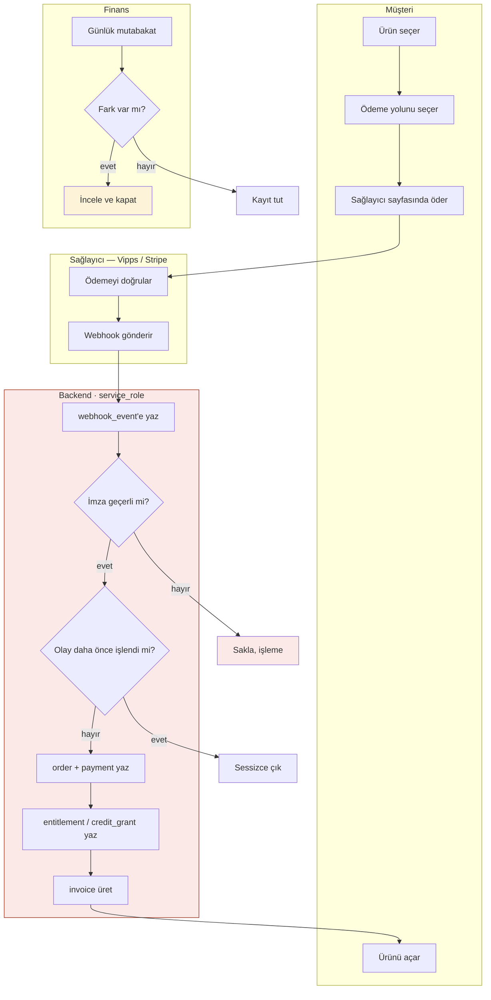

# Süreç: Ödeme → Erişim · Kontrol Matrisi

**Kapsam:** Müşteri ödemesinin alınmasından erişimin açılmasına kadar olan akış.
**Kaynak:** `docs/payment-architecture.md` · `db/schema.sql` · `db/auth.sql`
**Durum:** Kontroller kısmen *uygulanmış* (veritabanı kısıtı), kısmen *tasarlanmış*
(kod henüz yazılmadı — bu ayrım her satırda işaretli).

> **Not:** Bu doküman, sürecin yazılı anlatımı gelmediği için depoda tam
> belgelenmiş tek süreç üzerine kuruldu. Farklı bir süreç kastedildiyse
> yapı aynen taşınır, içerik değişir.

---

## 1. Süreç anlatımı

**1. Ürün seçimi.** Müşteri web sitesinden bir ürün veya hizmet seçer.
Fiyat ve para birimi `price` tablosundan okunur; katalog herkese açıktır
ancak yalnızca `active` kayıtlar görünür.

**2. Smart checkout.** Müşteriye üç ödeme yolu gösterilir: Vipps, kart/cüzdan
(Stripe) ve B2B için vadeli fatura. Seçenek sayısı bilinçli olarak sınırlıdır.
`checkout_session` kaydı açılır ve bir `idempotency_key` üretilir.

**3. Barındırılan ödeme sayfası.** Kart verisi hiçbir zaman bizim sistemimize
girmez; müşteri sağlayıcının sayfasına yönlendirilir. Bu, PCI kapsamını
sağlayıcıya bırakan bilinçli bir tasarım kararıdır.

**4. Sağlayıcı ödemeyi doğrular.** Vipps veya Stripe işlemi kendi tarafında
sonuçlandırır. **Müşterinin başarı sayfasına dönmesi ödeme kanıtı değildir.**
Bu kural istisnasızdır.

**5. Webhook alınır.** Sağlayıcı olayı bize gönderir. Olay önce
`webhook_event` tablosuna ham hâliyle yazılır — işlenmeden önce kaydedilir.

**6. İmza doğrulanır.** `signature_valid` false ise payload saklanır ama
işlenmez. Doğrulanmamış olay hiçbir kayda dokunamaz.

**7. Tekrar kontrolü.** `provider_event_id` daha önce görülmüşse işleyici
sessizce çıkar. Sağlayıcılar aynı olayı tekrar gönderir; bu normaldir.

**8. Mali kayıt yazılır.** `order`, `payment` ve varsa `subscription`
güncellenir. Olaylar sırasız gelebildiği için işleyici sıraya değil **duruma**
bakar; her olay kendi durumunu idempotent uygular.

**9. Erişim açılır.** `entitlement` kaydı oluşur veya `credit_grant` yüklenir.
Erişimin doğruluk kaynağı bu tablolardır; ürün tarafında `premium = true`
gibi bir bayrak yoktur.

**10. Fatura üretilir.** `invoice` kaydı ardışık ve boşluksuz bir numara alır.

**11. Günlük mutabakat.** Zamanlanmış iş sağlayıcıdaki ödemeleri bizim
kayıtlarla karşılaştırır, farkı `reconciliation_run` tablosuna yazar.

---

## 2. Risk ve kontrol matrisi

Tip: **Ö** önleyici · **T** tespit edici
Durum: **U** uygulanmış (DB kısıtı) · **T** tasarlanmış (kod gerekiyor)

| # | Risk | Kontrol | Tip | Durum | Sahip | Sıklık | Kanıt |
|---|---|---|---|---|---|---|---|
| R1 | Ödeme yapılmadan erişim açılır | Erişim yalnızca webhook yolundan açılır; başarı sayfası tetiklemez | Ö | T | Backend | Her işlem | `payment-architecture.md §4` |
| R2 | Sahte webhook ile erişim açılır | İmza doğrulanmadan olay işlenmez (`signature_valid`) | Ö | T | Backend | Her olay | `schema.sql:438` |
| R3 | Aynı olay iki kez işlenir, çift kredi yüklenir | `unique (provider, provider_event_id)` | Ö | **U** | Veritabanı | Her olay | `schema.sql:447` |
| R4 | Müşteri checkout'u tekrarlar, iki kez ücretlendirilir | `checkout_session.idempotency_key` unique | Ö | **U** | Veritabanı | Her oturum | `schema.sql:138` |
| R5 | Kredi iki kez harcanır (yarış durumu) | `credit_operation.request_id` unique + satır kilidi | Ö | **U** | Veritabanı | Her harcama | `schema.sql:352` |
| R6 | Webhook kaybolur; müşteri ödemiş ama erişimi yok | Günlük mutabakat işi, fark `mismatch_count`'a yazılır | T | T | Finans + Backend | Günlük | `schema.sql:459` |
| R7 | Fatura serisinde boşluk oluşur (mevzuat) | `invoice.number` unique, ardışık ve boşluksuz | Ö | **U** | Veritabanı | Her fatura | `schema.sql:388` |
| R8 | Kullanıcı kendi ödeme/erişim kaydını değiştirir | 8 tabloda RLS, kullanıcıya yalnızca okuma | Ö | **U** | Veritabanı | Sürekli | `auth.sql` · test W1-W4 |
| R9 | Kullanıcı sahte KDV numarasını doğrulanmış gösterir | Sütun seviyesinde GRANT; `vat_validated_at` yalnızca service_role | Ö | **U** | Veritabanı | Sürekli | `auth.sql` · test V1 |
| R10 | Kullanıcı silinince mali kayıt kaybolur | `auth_user_id` ayrı sütun, `on delete set null` | Ö | **U** | Veritabanı | Silme anında | `auth.sql` · test D1-D5 |
| R11 | Kart verisi sızar | Barındırılan ödeme sayfası; kart verisi sisteme girmez | Ö | T | Backend | Sürekli | `payment-architecture.md §9` |
| R12 | Yanlış vergi uygulanır | `order.tax_reason` ve `tax_rate_bp` kararı kaydeder | T | **U** | Muhasebe | Aylık | `schema.sql` |

---

## 3. Bulgular — eksik kontrol ve görev ayrılığı

### ⚠ B1 · Görev ayrılığı ihlali: `service_role` her şeyi yapar — **YÜKSEK**

Tek bir rol şunların hepsini yazabiliyor: `payment` (ödeme kaydı),
`entitlement` (erişim) ve `credit_grant` (kredi).

İnsan süreçlerindeki karşılığı, **tahsilatı kaydeden kişinin aynı zamanda
alacak silebilmesidir.** Bu rolü ele geçiren veya elinde tutan biri kendine
ücretsiz erişim açıp bunu meşru görünen bir kayıtla bırakabilir.

Bugün savunulabilir olmasının sebebi rolün yalnızca webhook kodunda
bulunması ve DB kısıtlarının telafi edici kontrol işlevi görmesi. Ancak bu
telafi yazılı değil. Gereken:

- Anahtarı kimin tuttuğu **yazılı** olmalı
- `service_role` ile yapılan her işlem loglanmalı
- Logu **başka biri** düzenli aralıkla gözden geçirmeli

### ⚠ B2 · Eksik kontrol: `anonymize_account()` sahipsiz — **YÜKSEK**

`auth.sql:305` fonksiyonu `public` ve `authenticated` rollerinden geri alıyor
— bu doğru. Ama **kimin çağırabileceği hiçbir yerde yazmıyor.**

GDPR silme işlemi geri alınamaz ve müşteri kaydına dokunur. Onaylayanı
belirtilmemiş bir fonksiyon kontrol değildir; kilidi olan ama anahtarı kimde
olduğu kayıtlı olmayan bir kapıdır. Canlıya çıkmadan önce sahip ve sıklık
atanmalı.

### ⚠ B3 · Eksik kontrol: iade için çift onay yok — **ORTA**

`refund` tablosu diğerleri gibi service_role tarafından yazılabiliyor.
Şemada bir iadenin ikinci bir kişi tarafından onaylanmasını gerektiren
hiçbir şey yok. Maker-checker uygulama kodunda var mı, doğrulanmalı.

### ⚠ B4 · Mutabakat sahibi belirsiz — **ORTA**

`reconciliation_run` farkı **kaydediyor** ama farkı kimin inceleyeceği ve
hangi sürede kapatacağı tanımlı değil. Kimsenin bakmadığı bir tespit
kontrolü, kontrol değil log'dur.

### ⚠ B5 · Kontrol tasarlanmış ama uygulanmamış — **DEĞİŞKEN**

Matristeki R1, R2, R6 ve R11 `T` (tasarlanmış) durumda — yani bugün yalnızca
dokümanda var. Uygulama kodu yazılana kadar bu satırlar **kontrol sayılmaz.**
R2 (imza doğrulama) bunlar içinde en kritiği: uygulanmazsa R3'teki unique
kısıt sahte olayı da sadakatle tekilleştirir.

---

## 4. Akış şeması

Kulvarlar role göre. Görev ayrılığı sorunu, çakışan iki adımın **aynı
kulvarda** olmasıyla görünür hâle gelir.

**Şemanın gösterdiği:** kırmızı kulvar `I` (ödeme kaydı) ve `J` (erişim
verme) adımlarını aynı role koyuyor. Görev ayrılığı isteseydik bu ikisi ayrı
kulvarlarda olurdu. Bugün ayıramıyoruz çünkü ikisini de aynı webhook işlemi
yapıyor — bu yüzden telafi edici kontrol (log + bağımsız gözden geçirme)
zorunlu hâle geliyor.

---

## 5. Kapatılması gerekenler

| Bulgu | Aksiyon | Kim | Ne zaman |
| --- | --- | --- | --- |
| B1 | service_role kullanımını logla, bağımsız gözden geçirme kur | Technical Lead | Canlıdan önce |
| B2 | `anonymize_account()` için sahip ve onay adımı ata | GDPR danışmanı | Canlıdan önce |
| B3 | İade için maker-checker doğrula veya kur | Backend | Faz 1 |
| B4 | Mutabakat farkı için sahip ve kapatma süresi ata | Finans | Mutabakat işiyle birlikte |
| B5 | R1, R2, R6, R11'i koda geçir | Backend | Faz 1 |
