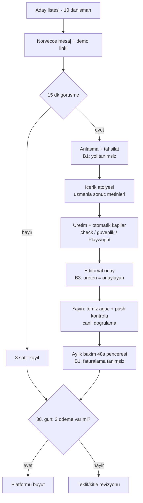

# Süreç belgesi — Action Pages pilotu (anlatı + risk-kontrol matrisi + akış)

Tarih: 25.08.2026. Kaynak: docs/action-pages-teklif.md + hukuk-kontrol.md
Memo 1 + rol-icerik-editoru.md. Standart format burada tanımlanır ve
bundan sonraki süreç belgeleri aynı yapıyı kullanır: Amaç → Kapsam →
Tetik → Adımlar → Çıktılar → Sistemler → Sahip; ardından risk-kontrol
matrisi, akış şeması ve bulgular.

## 1. Süreç anlatısı

**Amaç:** Uzman içeriğini müşteri üreten Action Page'e çevirip 30 günde
3 ücretli pilot satmak; satılmazsa platformu büyütmemek.
**Kapsam:** aday bulma → satış → kurulum → yayın → aylık bakım → ölçüm.
**Tetik:** kullanıcının aday listesini çıkarması. **Sahip:** kurucu.
**Sistemler:** depo (statik sayfa üretimi), Playwright doğrulama,
Vercel (tarif-tabanlı dağıtım), uzmanın kendi ödeme/randevu kanalları.

Adımlar:
1. **Aday listesi** — 10 kariyer danışmanı (kurucu; LinkedIn/Google).
2. **Ulaşım** — Norveççe mesaj + demo linki (kurucu gönderir).
3. **Görüşme (15 dk)** — teklif anlatılır; 3 satır kayıt: fiyat tepkisi
   / itiraz / evet-hayır.
4. **Anlaşma + tahsilat** — kurulum 4.900 NOK [H]. *Tahsilat yolu bugün
   tanımsız (bkz. bulgu B1).*
5. **İçerik atölyesi** — soru seti + sonuç metinleri uzmanla birlikte
   yazılır; belirlenimci puanlama, "garanti değildir" ibaresi zorunlu.
6. **Üretim** — sayfa depoda üretilir; otomatik kapılar: `npm run
   check`, `npm run guvenlik`, Playwright uçtan uca test.
7. **Onay** — editoryal onay. *Bugün üreten ile onaylayan aynı kişi
   (bkz. bulgu B3); editör rolü bu dikişi ayırır.*
8. **Yayın** — tarif-tabanlı dağıtım; ön koşul kontrolü: çalışma ağacı
   temiz + dal push'lu (qblogg-operasyon kuralı); canlı doğrulama.
9. **Bakım** — 690 NOK/ay [H]; değişiklik talepleri 48 saat penceresi.
   *Aylık faturalama süreci tanımsız (B1'in parçası).*
10. **Ölçüm + 30. gün kararı** — görüşme/satış kayıtlarıyla: 3 ödeme
    → büyüt; değilse teklif/kitle revizyonu.

**Çıktılar:** yayınlanmış Action Page, görüşme kayıtları, 30. gün
karar notu (proje günlüğüne).

## 2. Risk-kontrol matrisi

| # | Risk | Kontrol | Sahip | Sıklık | Durum |
|---|---|---|---|---|---|
| R1 | Satışta abartılı vaat (yanıltıcı pazarlama) | Teklifte [H] işaretleri; fiyat "test fiyatı" dili; hukuk Memo 1 sınırları | Kurucu | Her görüşme | VAR |
| R2 | Sonuç metninde uydurma/garanti dili | Belirlenimci puanlama; "ikke en garanti" ibaresi; editoryal onay | Kurucu → editör | Her teslim | VAR (onay dikişi zayıf, B3) |
| R3 | Kişisel verinin sunucuya sızması (müşteri form isterse) | v0 kuralı: veri tarayıcıda kalır; istisna hukuk kapısından geçer | Kurucu | Talep geldiğinde | KISMEN (B2: istisna adımı kontrol listesine bağlı değil) |
| R4 | Tahsilat/mutabakat hatası (kurulum + aylık) | — | — | — | **YOK (B1)** |
| R5 | Dağıtım hatası (push'suz dosya, bozuk tarif) | Temiz ağaç + push kontrolü; dağıtım sonrası canlı doğrulama | Kurucu | Her dağıtım | VAR |
| R6 | Tek kişi bağımlılığı (hastalık/kaza) | Her karar ve tarif depoda + günlükte; kayıttan kurtarma mümkün | Kurucu | Sürekli | KISMEN (işletme devri planı yok) |
| R7 | 7 gün SLA kaçırma | — (teslim takvimi izlenmiyor) | — | — | **YOK (B4)** |
| R8 | Müşteri içeriğinde telif ihlali | Uzman hak beyanı — sözleşme şablonu avukat teyidinde | Kurucu | Her anlaşma | KISMEN (şablon henüz yok) |

## 3. Akış şeması

## 4. Bulgular — eksik kontrol ve görev ayrılığı

- **B1 — Tahsilat kontrolü YOK (en acil):** 4.900 NOK'un nasıl
  alınacağı (faktura mı, Stripe/Vipps linki mi), aylık 690'ın nasıl
  yenileneceği ve ödemenin teslimatla mutabakatı tanımsız. Öneri:
  faktura + "ödeme alınmadan yayın yok" kuralı + tek satırlık tahsilat
  defteri (tarih/müşteri/tutar/durum). Şirket formu ve fatura kesme
  yetkisi kullanıcı adımıdır (org.nr gerekir).
- **B2 — Hukuk istisna adımı bağlanmamış:** müşteri form/lead isterse
  "avukat teyidi olmadan açılmaz" kuralı yazılı ama üretim adımının
  kontrol listesinde değil. Öneri: adım 6'ya tek soruluk kapı — "sayfa
  veri topluyor mu? Evetse DUR."
- **B3 — Görev ayrılığı (SoD):** satış, üretim, kalite onayı ve
  tahsilat aynı kişide. Tek kişilik şirkette tümü ayrıştırılamaz;
  ilk ayrıştırma editör rolü (üreten ≠ onaylayan, rol tanımı hazır),
  ikincisi tahsilat defterinin karardan ayrı tutulması.
- **B4 — SLA izleme yok:** "7 günde yayın" vaadi var, teslim tarihi
  takibi yok. Öneri: anlaşma günü + hedef tarih + gerçekleşen tarih,
  aynı tahsilat defterinde üç kolon.
- **B5 — Sözleşme şablonu eksik:** telif beyanı/tazmin maddeleri avukat
  teyidi bekliyor (hukuk-kontrol açık maddesi); ilk anlaşma imzadan
  önce bu şablonu ister.
