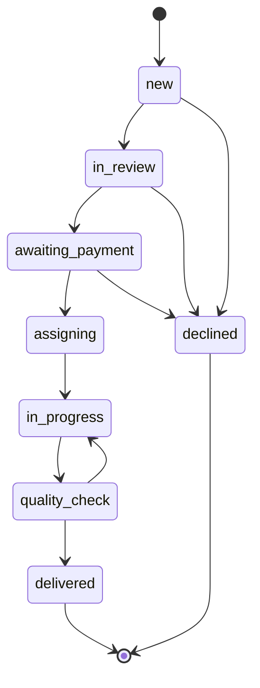

# NAVIAR — the service model

The operating model behind the site: who does what, in what order, and what a
case may cost. It is the spec the code in `server/db.js` is written against —
if the two disagree, one of them is wrong and it is worth finding out which.

Norwegian is the governing language of the business. This file is written in
English because the code is.

---

## 1. What NAVIAR is

NAVIAR matches a person who has a case with a public authority to someone who
can help them with it — an adviser, or an interpreter. NAVIAR takes the case
in, decides whether it can be helped, agrees the scope and the price, collects
the payment, chooses who does the work, checks the work before it goes out,
and pays the person who did it.

NAVIAR is an independent business. It is not part of NAV or of public
administration, and it says so on every page.

## 2. The two roles

They are separate and must not be blurred.

| | Adviser (*rådgiver*) | Interpreter (*tolk*) |
|---|---|---|
| Explains what a letter means | yes | no |
| Suggests what to do next | yes | no |
| Translates what is being said | no | yes |
| Speaks on the customer's behalf | no | no |

An interpreter conveys; they do not advise. An adviser advises; they do not
interpret. **If one person holds both roles on the same case, the customer is
told which role is in play before the work begins.** Not afterwards, and not
by implication.

## 3. What a case costs

| Code | | Price | What the customer gets |
|---|---|---|---|
| — | Career Starter | free | CV checklist, five prompts, job tracker, weekly plan |
| K01 | AI Career Kit | 299 NOK | CV templates (NO/EN), prompt pack, application system, interview prep, STAR worksheet, LinkedIn checklist, tracker, 30-day plan |
| K02 | LinkedIn review | 390 NOK | Headline, About and experience in writing, with the three things to change first |
| K03 | Digital job-search setup | 390 NOK | 45 min setting up searches and alerts on Arbeidsplassen, Finn and LinkedIn — on the customer's own screen |
| K04 | Mock interview | 590 NOK | 45 min against a real advert, feedback answer by answer |
| K05 | CV and application review | 790 NOK | 45 min on one CV and one application, prioritised improvements, one follow-up |

Eight services: the six career services the pilot started with, plus the two
below, taken back off the shelf on the owner's decision of 24 August 2026.
Six was never a ceiling — the wording that follows explains why it started
narrow. Not because the rest is risky — practical guidance,
language help, digital admin support and small-business work would all sit
inside the same boundary — but because a customer has to be able to tell what
NAVIAR does at a glance, and because a narrow line is one you can actually
deliver well twenty times. The others come back when someone asks for them.

The rest of what NAVIAR could sell inside the same boundary — some forty
services across career, language, digital admin, digital products and small
business — is written down in `tjenestekatalog.md` with prices, so "add it when
someone asks" has something to add from.

| V01 | Praktisk veiviser | 590 NOK | 30 min together and a short written guide: the right public channel, a question list, a practical checklist. One follow-up. Shows the way — never interprets a vedtak, never contacts anyone on the customer's behalf. |
| S01 | Privat språkstøtte | quote only | Language help in private, everyday settings. Never a replacement for the official interpreter in meetings with a public body (tolkeloven) — the description says so on the card. Quote-only (`price: null`) until an interpreter bench is contracted, so no checkout exists for it. |

**Un-shelved, 24 August 2026:** the owner re-opened public-services guidance
and interpreting ("kamu hizmetleri danışmanlığı" + "tolke tjeneste"). The
shelf mechanism worked as designed: translations for both had been kept in
all ten locales and moved straight back into the catalogue. `sjekk` (the old
free advice check) stays retired — the wizard's built-in scope check replaced
it. The refusal list in `hva-vi-gjor.html` is unchanged and binds these two
services hardest of all.

**The standing rule, set by the owner the same day:** every new concept gets
a legal check before it is sold — against the refusal list first, and where
the refusal list does not answer, it goes on the lawyer's question list
before launch, not after.

Each paid human service has a written scope in `leveranser/karriere/tjenester/`
saying what the adviser does and where they stop. That is what makes two
advisers deliver the same 790 kr review.

Every paid career service ships files that exist in `leveranser/karriere/`, and
a test fails if one of them goes missing or turns up nearly empty. A price on
the page with nothing behind it is the worst kind of promise this business can
make.

The catalogue in `assets/js/config.js` is the single source of truth for
prices. The server recomputes every amount from it; nothing the browser sends
about money is trusted.

### How the catalogue got to six

Two decisions, a day apart, and the second replaced the first.

**21 August, first:** v2.0 of the model was read as the career line's spec
rather than a replacement catalogue, so Praktisk veiviser and private language
support stayed and the catalogue held six mixed services.

**21 August, second — and this is the one that holds:** the owner set the
starting portfolio explicitly at six career services, with the reasoning that
low risk is not a reason to sell everything at once. Praktisk veiviser and
language support were shelved. The earlier reading is recorded here only so
nobody re-derives it from the model document and undoes this.

### The career rules

What NAVIAR is, in one sentence: **career tools a job seeker uses on their own
application, plus a human review — not a recruitment system that decides
anything on an employer's behalf.** That distinction is the whole risk
position, and every rule below protects it.

- We never invent experience, education, results or references. The facts come
  from the customer.
- The customer is always told when AI has been used. Everything AI produces is
  labelled a **draft** until a person has read it.
- A person checks every personalised deliverable before it goes out.
- AI uses only what the customer supplied. A CV that must pass through an AI
  tool is anonymised as far as it can be first.
- Customer CVs are never used to train models, and never shared with employers
  or third parties.
- No promise of a job and no promise of an interview.
- NAVIAR does not apply for jobs, contact employers, or act as the candidate.
  The customer approves and sends every application themselves.
- Nothing goes into an open AI tool that should not: national ID numbers,
  health data, credentials, or a referee's private contact details.
- Out of scope, and referred on: employment-law disputes, dismissal,
  discrimination assessments, sickness-absence cases, salary and tax advice.

### What the product must never contain

Not "not yet" — these are outside the product:

- ranking or scoring candidates for employers
- automatic selection or rejection of applicants
- sending an application, or contacting an employer, for the customer
- emotion or personality analysis from video or audio
- facial recognition or other biometric analysis
- assessment based on health, disability, ethnicity or religion
- selling CV data to employers or third parties

A data test fails if any of those words turns up in what the catalogue sells.

### The data floor

The first form collects **name, email, language and what the customer wants to
achieve. Nothing else, and no documents.** A CV, where one is needed at all,
arrives afterwards over a separate secure link, for the personal review only —
seen by the person assigned to that case, and deleted after delivery.

Never asked for, and never to be received:

national ID numbers · BankID, PIN or passwords · health data · ethnicity,
religion, political opinion or trade-union membership · a referee's contact
details without their agreement · passports or identity documents ·
confidential documents from a former employer

### Payment and consumer terms

- Career Starter free, Career Kit 299, personal review 790. All one-off.
- No subscription, no automatic renewal, no hidden charges.
- Full contents and full price shown before purchase.
- Stripe or PayPal; NAVIAR never holds card details.
- A digital pack delivered immediately needs the customer's explicit consent to
  immediate delivery and their acknowledgement that the withdrawal right ends
  once delivery is complete. A customer who would rather wait keeps the usual
  14 days.
- **One payment product per price.** Do not reuse a link built for a different
  amount.

### Affiliate income

Not built, and not the pilot's income model. If it is ever added:

- every link marked as advertising (*Reklamelenke*)
- the commission relationship stated plainly, not buried inside a review
- no customer CV or personal data passed to the affiliate

### The pilot organisation

No open consultant marketplace in the pilot. Personal reviews are done by a
small number of career advisers NAVIAR has chosen and contracted, who:

- sign a confidentiality agreement
- are trained on the AI and data rules before taking a case
- see only the file assigned to them
- never take payment from a customer outside the system
- never promise a job and never give legal advice

### What we will not take

Not a matter of judgement in the moment — this list is fixed:

- interpreting a decision, refusal, appeal or legal deadline
- judging a right, or the likely outcome of a case
- advice on health, tax, debt, finance or residency
- submitting or signing an application for the customer
- contacting NAV on the customer's behalf without a valid *fullmakt*
- using BankID, a PIN, a password or a one-time code
- collecting health records, national ID numbers or other sensitive documents
- private language support in place of an official interpreter in a meeting
  with a public body

Three of those are not house rules but the law's: acting for someone towards
NAV requires a written *fullmakt* stating what it covers and for how long; a
public body assesses and orders the interpreter for its own meetings
(tolkeloven); and a BankID password is never to be shared with anyone.

`hva-vi-gjor.html` is this list, written for the customer, in Norwegian and
English; `karriere.html` is the career half of it. A test fails if the catalogue ever sells one of the withdrawn
services again.

## 4. The revenue split

On a 1 500 NOK task the adviser keeps 1 200 NOK and NAVIAR keeps 300 —
80/20 on the fee ex-MVA (`commissionRate: 0.20`).

**This is not published on the site, and should not be until a lawyer has
looked at it.** Two reasons. First, a split promised in public to people who
have not yet signed anything is a commitment that is hard to walk back if the
numbers turn out not to work. Second, and more seriously, the split is the
kind of term that decides whether an adviser is an independent contractor
(*oppdragstaker*) or an employee (*arbeidstaker*) — a question with tax and
employer-obligation consequences that has to be settled before the first
adviser is engaged, not after.

## 5. The customer's path

1. The customer fills in a free scope check and says what they need.
2. The form shows the high-risk work in full, and the customer confirms their
   request is practical help only.
3. A person at NAVIAR reads it. Nothing here is automatic.
4. A request that does not fit is referred to the right body or expert.
5. A request that fits gets the scope, the price and the terms in writing.
6. Only then does a payment link go out.
7. The customer pays.
8. A suitable adviser or interpreter is chosen.
9. The adviser does the agreed task and nothing beyond it.
10. It is read through before it goes out.
11. The customer gets it, and the adviser is paid.

There is no buy button. A customer cannot reach payment without the scope
check, and the site cannot create one: every request the server accepts is
recorded as `new` whatever the browser sends, and `paymentLinks` in the config
is empty and tested for.

Step 2 is also a record, not only a gate. The server refuses a request that
does not carry the confirmation (`scope_confirmation_required`) and stores it
on the case as `low_risk`, and the queue shows it against every case. A check
that only ran in a browser would be no check at all — anything can post to the
endpoint — and it would leave nothing to point at afterwards.

## 6. The case workflow

The states below are the ones in `BOOKING_STATUS`, and the arrows are the ones
in `BOOKING_TRANSITIONS`. The server refuses any move that is not drawn here.

| State | Norwegian | Means |
|---|---|---|
| `new` | Ny | Arrived, nobody has looked at it |
| `in_review` | Under vurdering | The free scope check |
| `awaiting_payment` | Venter på betaling | Scope, price and terms sent; money not in |
| `assigning` | Finner rådgiver | Paid; a person is choosing who does it |
| `in_progress` | Under arbeid | The work is being done |
| `quality_check` | Kvalitetssikring | Being read before it goes out |
| `delivered` | Levert | The customer has it |
| `declined` | Avvist | We will not take it — referred on |
| `cancelled` | Avbrutt | Abandoned |

The edges that are missing are the point:

- Nothing reaches `awaiting_payment` except through `in_review`. Nobody is
  quoted a price before a person has read the request.
- Nothing reaches `assigning` except through `awaiting_payment`. No adviser is
  put on a case that has not been paid for.
- Nothing reaches `delivered` except through `quality_check`. Quality control
  cannot be skipped by an operator in a hurry.
- `delivered` and `declined` are terminal. A finished case is finished.

`quality_check → in_progress` is the one edge that goes backwards: work that is
not good enough goes back to the person who did it.

Payment moves a case out of `awaiting_payment` and into `assigning`, and only
from there. It is the Stripe webhook that does it, on a verified signature.
Nothing in the browser can mark a case paid.

## 7. What stays manual

For the first 10–20 customers these are done by a person, deliberately:

- choosing the adviser
- sharing anything sensitive
- quality control
- refunds
- judging a case that carries legal risk
- releasing the adviser's payment

The purpose of the pilot is to find out two things: whether people will
actually pay 800 NOK, and whether advisers deliver reliably. Neither question
is answered by software. Automatic matching and richer task management come
after the answers, not before.

The same reasoning is why most of the launch kit's *do not build yet* list
still holds: no customer accounts, no subscriptions, no reviews, no document
upload, no AI legal advice, no app.

Two items left that list on the owner's decisions of 24–25 August 2026
(experts register themselves and consult in their own field; NAVIAR takes a
commission from the payment it collects): the pilot now has an **adviser
registry** (self-registration on `radgiver.html`, approval by a person,
assignment only while a case is in `assigning`, and only to an approved
adviser) and a **commission ledger** (the split of the customer's payment is
written when the case is delivered; payout to the adviser is a manual stamp).
Every entry in the list above stays manual: a person approves each adviser,
chooses the adviser for each case, and releases each payment. Automatic
matching and automatic payout remain unbuilt on purpose. The commission rate
is not published; it stands in the written agreement each adviser receives
before signing.

## 7a. Sources

The rules above were set by the business owner, who cited Datatilsynet on data
minimisation and on databehandleravtaler, the EU AI Act's employment
provisions, digitalytelsesloven and angrerettloven on digital delivery and
withdrawal, Forbrukertilsynet on marking advertising, and Nkom on AI labelling.

Those citations have not been read from this repository — the network here
blocks the sources — so this file records **what NAVIAR has committed to**, not
an interpretation of what the law requires. The lawyer review below is where
the two get reconciled.

## 7a. What this model does not fix

It lowers the risk considerably. It does not remove it. Before this goes public
a Norwegian lawyer needs to read the customer contract, the right-of-withdrawal
handling, the privacy notice, the adviser agreement and the insurance cover.
Nothing in this repository is a substitute for that.

Still outstanding, and none of it is code: databehandleravtaler with the AI and
cloud providers actually used, a written retention and deletion schedule, an
incident procedure, professional and cyber liability insurance, and the adviser
training and confidentiality agreements. The first twenty cases should be
audited by hand.

## 8. The rules that do not bend

- Never ask a customer for their BankID password or code.
- Never log in as the customer.
- Work is done with the customer at the screen, or under a valid *fullmakt*.
- Sensitive documents never go by ordinary email.
- No promise of an outcome, ever.
- A case that needs legal representation goes to a lawyer.
- Health, tax and immigration cases get a second pair of eyes.
