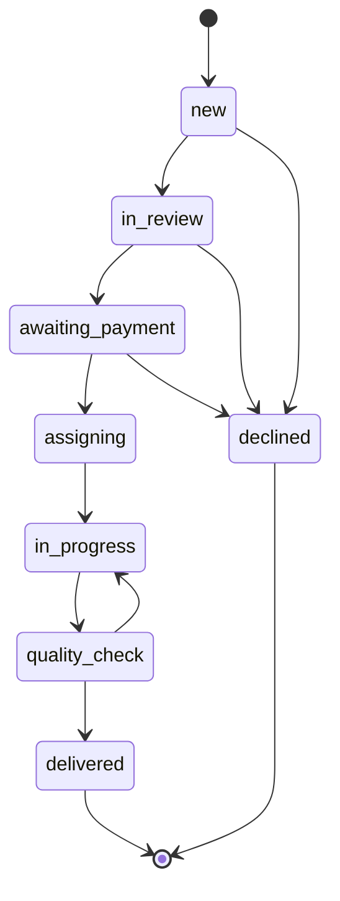

# NAVIAR — the service model

The operating model behind the site: who does what, in what order, and what a
case may cost. It is the spec the code in `server/db.js` is written against —
if the two disagree, one of them is wrong and it is worth finding out which.

Norwegian is the governing language of the business. This file is written in
English because the code is.

---

## 1. What NAVIAR is

NAVIAR matches a person who has a case with a public authority to someone who
can help them with it — an adviser, or an interpreter. NAVIAR takes the case
in, decides whether it can be helped, agrees the scope and the price, collects
the payment, chooses who does the work, checks the work before it goes out,
and pays the person who did it.

NAVIAR is an independent business. It is not part of NAV or of public
administration, and it says so on every page.

## 2. The two roles

They are separate and must not be blurred.

| | Adviser (*rådgiver*) | Interpreter (*tolk*) |
|---|---|---|
| Explains what a letter means | yes | no |
| Suggests what to do next | yes | no |
| Translates what is being said | no | yes |
| Speaks on the customer's behalf | no | no |

An interpreter conveys; they do not advise. An adviser advises; they do not
interpret. **If one person holds both roles on the same case, the customer is
told which role is in play before the work begins.** Not afterwards, and not
by implication.

## 3. What a case costs

| | Price | What the customer gets |
|---|---|---|
| Scope check | free | We say whether we can help, within one working day |
| V01 — practical guide | 590 NOK | 30 minutes together, plus a short guide: the right public channel, a list of questions, a practical checklist, one follow-up |
| AI Career Starter | free | A CV checklist, five prompts, a job tracker |
| AI Career Kit | 299 NOK | CV templates (NO/EN), prompts, interview preparation, LinkedIn checklist, tracker, weekly plan |
| Personal CV review | 790 NOK | 45 minutes with a person on one CV and one targeted application, plus one follow-up |
| Private language support | by quote | Private, everyday conversations only |

Every paid career service ships files that exist in `leveranser/karriere/`, and
a test fails if one of them goes missing or turns up nearly empty. A price on
the page with nothing behind it is the worst kind of promise this business can
make.

The catalogue in `assets/js/config.js` is the single source of truth for
prices. The server recomputes every amount from it; nothing the browser sends
about money is trusted.

### The career rules

AI-assisted career work carries its own line, on top of the list below:

- We never invent experience, education, results or references. The facts come
  from the customer.
- A person reads through every AI-assisted deliverable before it goes out.
- No promise of a job and no promise of an interview.
- NAVIAR does not apply for jobs, contact employers, or act as the candidate.
  The customer approves and sends every application themselves.
- Nothing goes into an open AI tool that should not: national ID numbers,
  health data, credentials, or a referee's private contact details.
- Out of scope, and referred on: employment-law disputes, dismissal,
  discrimination assessments, sickness-absence cases, salary and tax advice.

### What we will not take

Not a matter of judgement in the moment — this list is fixed:

- interpreting a decision, refusal, appeal or legal deadline
- judging a right, or the likely outcome of a case
- advice on health, tax, debt, finance or residency
- submitting or signing an application for the customer
- contacting NAV on the customer's behalf without a valid *fullmakt*
- using BankID, a PIN, a password or a one-time code
- collecting health records, national ID numbers or other sensitive documents
- private language support in place of an official interpreter in a meeting
  with a public body

Three of those are not house rules but the law's: acting for someone towards
NAV requires a written *fullmakt* stating what it covers and for how long; a
public body assesses and orders the interpreter for its own meetings
(tolkeloven); and a BankID password is never to be shared with anyone.

`hva-vi-gjor.html` is this list, written for the customer, in Norwegian and
English; `karriere.html` is the career half of it. A test fails if the catalogue ever sells one of the withdrawn
services again.

## 4. The revenue split

On a 1 500 NOK task the adviser keeps 1 200 NOK and NAVIAR keeps 300 —
80/20 on the fee ex-MVA (`commissionRate: 0.20`).

**This is not published on the site, and should not be until a lawyer has
looked at it.** Two reasons. First, a split promised in public to people who
have not yet signed anything is a commitment that is hard to walk back if the
numbers turn out not to work. Second, and more seriously, the split is the
kind of term that decides whether an adviser is an independent contractor
(*oppdragstaker*) or an employee (*arbeidstaker*) — a question with tax and
employer-obligation consequences that has to be settled before the first
adviser is engaged, not after.

## 5. The customer's path

1. The customer fills in a free scope check and says what they need.
2. The form shows the high-risk work in full, and the customer confirms their
   request is practical help only.
3. A person at NAVIAR reads it. Nothing here is automatic.
4. A request that does not fit is referred to the right body or expert.
5. A request that fits gets the scope, the price and the terms in writing.
6. Only then does a payment link go out.
7. The customer pays.
8. A suitable adviser or interpreter is chosen.
9. The adviser does the agreed task and nothing beyond it.
10. It is read through before it goes out.
11. The customer gets it, and the adviser is paid.

There is no buy button. A customer cannot reach payment without the scope
check, and the site cannot create one: every request the server accepts is
recorded as `new` whatever the browser sends, and `paymentLinks` in the config
is empty and tested for.

Step 2 is also a record, not only a gate. The server refuses a request that
does not carry the confirmation (`scope_confirmation_required`) and stores it
on the case as `low_risk`, and the queue shows it against every case. A check
that only ran in a browser would be no check at all — anything can post to the
endpoint — and it would leave nothing to point at afterwards.

## 6. The case workflow

The states below are the ones in `BOOKING_STATUS`, and the arrows are the ones
in `BOOKING_TRANSITIONS`. The server refuses any move that is not drawn here.

| State | Norwegian | Means |
|---|---|---|
| `new` | Ny | Arrived, nobody has looked at it |
| `in_review` | Under vurdering | The free scope check |
| `awaiting_payment` | Venter på betaling | Scope, price and terms sent; money not in |
| `assigning` | Finner rådgiver | Paid; a person is choosing who does it |
| `in_progress` | Under arbeid | The work is being done |
| `quality_check` | Kvalitetssikring | Being read before it goes out |
| `delivered` | Levert | The customer has it |
| `declined` | Avvist | We will not take it — referred on |
| `cancelled` | Avbrutt | Abandoned |

The edges that are missing are the point:

- Nothing reaches `awaiting_payment` except through `in_review`. Nobody is
  quoted a price before a person has read the request.
- Nothing reaches `assigning` except through `awaiting_payment`. No adviser is
  put on a case that has not been paid for.
- Nothing reaches `delivered` except through `quality_check`. Quality control
  cannot be skipped by an operator in a hurry.
- `delivered` and `declined` are terminal. A finished case is finished.

`quality_check → in_progress` is the one edge that goes backwards: work that is
not good enough goes back to the person who did it.

Payment moves a case out of `awaiting_payment` and into `assigning`, and only
from there. It is the Stripe webhook that does it, on a verified signature.
Nothing in the browser can mark a case paid.

## 7. What stays manual

For the first 10–20 customers these are done by a person, deliberately:

- choosing the adviser
- sharing anything sensitive
- quality control
- refunds
- judging a case that carries legal risk
- releasing the adviser's payment

The purpose of the pilot is to find out two things: whether people will
actually pay 800 NOK, and whether advisers deliver reliably. Neither question
is answered by software. Automatic matching and richer task management come
after the answers, not before.

The same reasoning is why the launch kit's *do not build yet* list still holds:
no adviser marketplace, no customer accounts, no subscriptions, no reviews, no
document upload, no AI legal advice, no app, no commission accounting.

## 7a. What this model does not fix

It lowers the risk considerably. It does not remove it. Before this goes public
a Norwegian lawyer needs to read the customer contract, the right-of-withdrawal
handling, the privacy notice, the adviser agreement and the insurance cover.
Nothing in this repository is a substitute for that.

## 8. The rules that do not bend

- Never ask a customer for their BankID password or code.
- Never log in as the customer.
- Work is done with the customer at the screen, or under a valid *fullmakt*.
- Sensitive documents never go by ordinary email.
- No promise of an outcome, ever.
- A case that needs legal representation goes to a lawyer.
- Health, tax and immigration cases get a second pair of eyes.
