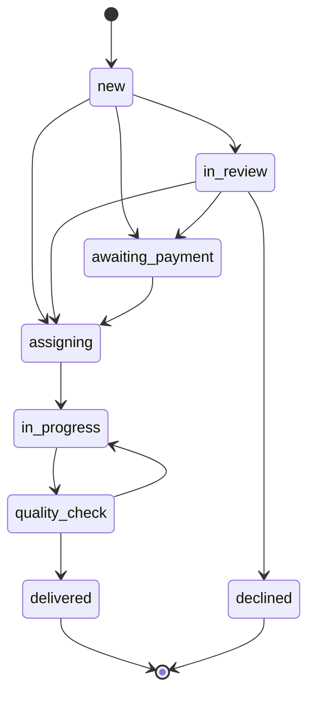

# NAVIAR — the service model

The operating model behind the site: who does what, in what order, and what a
case may cost. It is the spec the code in `server/db.js` is written against —
if the two disagree, one of them is wrong and it is worth finding out which.

Norwegian is the governing language of the business. This file is written in
English because the code is.

---

## 1. What NAVIAR is

NAVIAR matches a person who has a case with a public authority to someone who
can help them with it — an adviser, or an interpreter. NAVIAR takes the case
in, decides whether it can be helped, agrees the scope and the price, collects
the payment, chooses who does the work, checks the work before it goes out,
and pays the person who did it.

NAVIAR is an independent business. It is not part of NAV or of public
administration, and it says so on every page.

## 2. The two roles

They are separate and must not be blurred.

| | Adviser (*rådgiver*) | Interpreter (*tolk*) |
|---|---|---|
| Explains what a letter means | yes | no |
| Suggests what to do next | yes | no |
| Translates what is being said | no | yes |
| Speaks on the customer's behalf | no | no |

An interpreter conveys; they do not advise. An adviser advises; they do not
interpret. **If one person holds both roles on the same case, the customer is
told which role is in play before the work begins.** Not afterwards, and not
by implication.

## 3. What a case costs

| | Price | What the customer gets |
|---|---|---|
| Fit check | free | We say whether we can help, within one working day |
| K01 — a letter explained | 800 NOK | The letter in plain language, the deadline, and what to do next, in 24–48 hours |
| K02 — clarity call | 1 500 NOK | 45 minutes with an adviser |
| Interpreter | by quote | Booked per assignment |

The catalogue in `assets/js/config.js` is the single source of truth for
prices. The server recomputes every amount from it; nothing the browser sends
about money is trusted.

## 4. The revenue split

On a 1 500 NOK task the adviser keeps 1 200 NOK and NAVIAR keeps 300 —
80/20 on the fee ex-MVA (`commissionRate: 0.20`).

**This is not published on the site, and should not be until a lawyer has
looked at it.** Two reasons. First, a split promised in public to people who
have not yet signed anything is a commitment that is hard to walk back if the
numbers turn out not to work. Second, and more seriously, the split is the
kind of term that decides whether an adviser is an independent contractor
(*oppdragstaker*) or an employee (*arbeidstaker*) — a question with tax and
employer-obligation consequences that has to be settled before the first
adviser is engaged, not after.

## 5. The customer's path

1. The customer describes what they need.
2. NAVIAR reviews it — can we help, and may we.
3. Scope and price are agreed.
4. The customer pays.
5. A suitable adviser or interpreter is chosen.
6. The work is done.
7. It is read through before it goes out.
8. The customer gets it.
9. The person who did the work is paid.

## 6. The case workflow

The states below are the ones in `BOOKING_STATUS`, and the arrows are the ones
in `BOOKING_TRANSITIONS`. The server refuses any move that is not drawn here.

| State | Norwegian | Means |
|---|---|---|
| `new` | Ny | Arrived, nobody has looked at it |
| `in_review` | Under vurdering | The free fit check |
| `awaiting_payment` | Venter på betaling | Scope agreed, money not in |
| `assigning` | Finner rådgiver | Paid; a person is choosing who does it |
| `in_progress` | Under arbeid | The work is being done |
| `quality_check` | Kvalitetssikring | Being read before it goes out |
| `delivered` | Levert | The customer has it |
| `declined` | Avvist | We will not take it — referred on |
| `cancelled` | Avbrutt | Abandoned |

Three of these edges exist to stop something specific:

- Nothing reaches `delivered` except through `quality_check`. Quality control
  cannot be skipped by an operator in a hurry.
- Nothing reaches `in_progress` except through `assigning`. Work does not start
  before somebody has been chosen to do it.
- `delivered` and `declined` are terminal. A finished case is finished.

`quality_check → in_progress` is the one edge that goes backwards: work that is
not good enough goes back to the person who did it.

Payment moves a case out of `awaiting_payment` and into `assigning`, and only
from there. It is the Stripe webhook that does it, on a verified signature.
Nothing in the browser can mark a case paid.

## 7. What stays manual

For the first 10–20 customers these are done by a person, deliberately:

- choosing the adviser
- sharing anything sensitive
- quality control
- refunds
- judging a case that carries legal risk
- releasing the adviser's payment

The purpose of the pilot is to find out two things: whether people will
actually pay 800 NOK, and whether advisers deliver reliably. Neither question
is answered by software. Automatic matching and richer task management come
after the answers, not before.

The same reasoning is why the launch kit's *do not build yet* list still holds:
no adviser marketplace, no customer accounts, no subscriptions, no reviews, no
document upload, no AI legal advice, no app, no commission accounting.

## 8. The rules that do not bend

- Never ask a customer for their BankID password or code.
- Never log in as the customer.
- Work is done with the customer at the screen, or under a valid *fullmakt*.
- Sensitive documents never go by ordinary email.
- No promise of an outcome, ever.
- A case that needs legal representation goes to a lawyer.
- Health, tax and immigration cases get a second pair of eyes.
